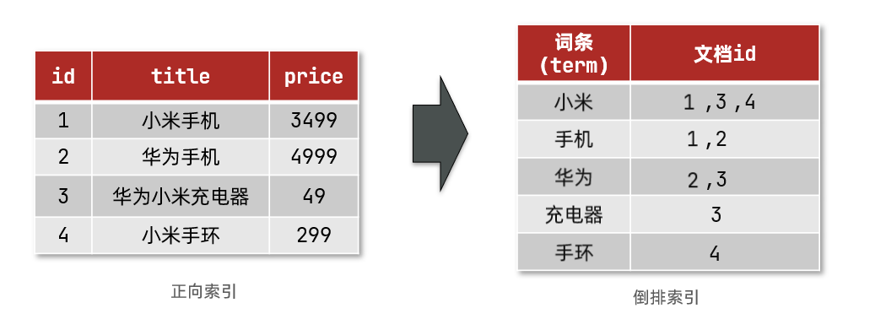

https://www.cnblogs.com/buchizicai/p/17093719.html
[Elasticsearch 中文文档](https://elasticsearch.bookhub.tech/)
[黑马Elasticsearch实战教程，快速掌握Elasticsearch倒排索引机制，详解海量数据搜索如何高效实现，手把手带你实现企业级搜索解决方案_哔哩哔哩_bilibili](https://www.bilibili.com/video/BV1Dv421v7QZ/?spm_id_from=333.337.search-card.all.click&vd_source=32d7b7aca593de01e7de9c2be4a87152)
看到1小时整

# ElasticSearch
## ElasticSearch 概述
ElasticSearch 是一个开源的分布式搜索引擎，可用于存储、搜索和分析数据、统计日志、监控系统等，底层基于 lucene 实现。
## elastic stack(ELK)
以 ElasticSearch 为核心的技术栈，包括 Beats、Logstash、Kibana、ElasticSearch。该技术栈被广泛应用于日志数据分析、实时监控等领域。
- Kibana：可视化 ElasticSearch 中的数据。
- ElasticSearch：存储、搜索、计算、分析数据。
- Logstash、Beats：抓取数据后存入 ElasticSearch。
## Lucene
Lucene 是 Apache 开源的一个用 Java 语言开发的搜索引擎类库，提供了搜索引擎的核心 API。
- 优点
	- 高性能（基于倒排索引）
- 缺点
	- 仅限 Java 开发。
## 倒排索引
倒排索引的概念是基于 MySQL 这样的正向索引而言的。
### 正向索引
在 MySQL 中，如果需要模糊查询，只能逐行扫描数据，判断每行数据中的内容是否符合用户模糊搜索的条件，如果符合，则放入结果集，不符合则丢弃。
逐行扫描，也即全表扫描。随着数据量增加，其查询效率会越来越低。

### 倒排索引
倒排索引中引入了几个重要概念：
- 文档（Document）：指用来搜索的数据。每一条数据就是一个文档。例如一个网页、一条商品信息。类比关系型数据库表中的一条数据。文档数据以 Json 格式存储在 elasticsearch 中。Json 文档中包含的字段（Field），类比关系型数据库中的列。
	- 
- 词条（Term）：对文档数据或用户搜索的数据，利用某种算法分词后得到的、具备含义的词语称为词条。例如一个数据：`“我是中国人”`，可以用某种算法分词为：`“我”`、`“是”`、`“中国人”`、`“中国”`、`“国人”`几个词条。词条间是唯一的。
#### 倒排索引的创建

1. 将每一个`文档`中的`数据`，利用算法进行`分词`，得到一个个`词条`。
2. 每行数据包括`词条`、词条所在`文档 id`、位置等信息。其中，根据`词条`创建`倒排索引`（词条唯一）。
#### 倒排索引的搜索
1. 用户输入条件如`"手机"`进行搜索。
2. 对用户的输入内容进行分词，得到词条如：`手`、`手机`。
3. 根据词条在倒排索引中查找，得到所有包含词条的文档 id。
4. 根据文档 id 到正向索引中查找文档内容。
## 分词器
### IK 分词器
## 基本概念
- 索引（index）：相同类型的文档的集合，类比关系型数据库中的某个具体的表。
- 映射（mapping）：索引中文档字段的约束信息，类似关系型数据库中的表结构。
- DSL：elasticsearch 提供的 JSON 风格的请求语句，用以操作 elasticsearch 实现 CRUD。
# 快速入门
## Docker 部署
### 拉取镜像
```C++
docker pull docker.elastic.co/elasticsearch/elasticsearch:7.11.2
```
### 启动容器
```Java
docker run \
  -p 9200:9200 \
  -e discovery.type=single-node \
  -e ES_JAVA_OPTS="-Xms512m -Xmx1024m" \
  -d \
  --name elasticsearch7_11 \
  docker.elastic.co/elasticsearch/elasticsearch:7.11.2
```
### 配置 Elasticsearch
### 测试 Elasticsearch
浏览器访问：http://IP 地址:9200，响应信息例：
```json
{
  "name": "13259b97e90f",
  "cluster_name": "docker-cluster",
  "cluster_uuid": "1CgPv87uTo2R8otNKOyF8A",
  "version": {
    "number": "7.11.2",
    "build_flavor": "default",
    "build_type": "docker",
    "build_hash": "3e5a16cfec50876d20ea77b075070932c6464c7d",
    "build_date": "2021-03-06T05:54:38.141101Z",
    "build_snapshot": false,
    "lucene_version": "8.7.0",
    "minimum_wire_compatibility_version": "6.8.0",
    "minimum_index_compatibility_version": "6.0.0-beta1"
  },
  "tagline": "You Know, for Search"
}
```
## SpringBoot 集成
### 初始化 RestHighLevelClient
elasticsearch 提供的API中，与 elasticsearch 的所有交互都封装在一个名为 RestHighLevelClient 的类中，必须先完成这个对象的初始化，建立与 elasticsearch 的连接。
#### 引入 RestHighLevelClient 依赖
```xml
<!-- ElasticSearch -->  
<dependency>  
    <groupId>org.elasticsearch.client</groupId>  
    <artifactId>elasticsearch-rest-high-level-client</artifactId>  
    <version>7.11.2</version>  
</dependency>
```
#### 配置 ElasticSearch
```yml
# \src\main\resources\application.yaml

spring:
  elasticsearch:
    uris: http://127.0.0.1:9200
```
#### 初始化 RestHighLevelClient
```Java
@Slf4j  
@Configuration  
public class ElasticSearchConfig {  
  
    @Value("${spring.elasticsearch.uris}")  
    private String host;  
  
    @Bean(destroyMethod = "close")
    public RestHighLevelClient restHighLevelClient() {  
        RestClientBuilder builder = RestClient.builder(HttpHost.create(host));  
        return new RestHighLevelClient(builder);  
    }  
}
```
## 索引操作
### 创建索引

### 查询索引
查询指定索引名 `index_name` 对应的索引表信息。
`GET /index_name`
### 删除索引
删除指定索引名 `index_name` 对应的索引表。
`DELETE /index_name`
## 文档操作
### 查询文档
查询指定索引名 `index_name` 下的所有文档。
`GET /index_name/_search`
### 删除文档
删除指定索引名 `index_name` 下指定 id 的文档。
`DELETE /index_name/_doc/{id}`