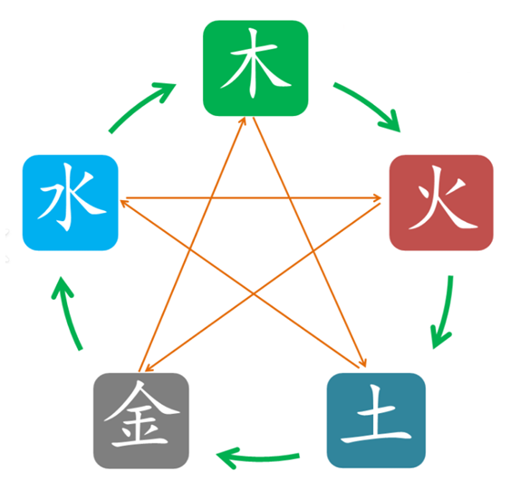

# 五行与生克
## 五行
五行：木、火、土、金、水。
## 生克
五行相生：木生火、火生土、土生金、金生水、水生木。
五行相克：木克土、火克金、土克水、金克木、水克火。

# 阴阳、干支与二十四节气
## 阴阳
天地万物都可以由阴、阳两种元素描述。
阳主天，主男人，主阳刚。
阴主地，主女人，主阴柔。
## 干支
### 天干
五行按阴阳细分，产生十大天干。
甲、乙、丙、丁、戊、己、庚、辛、壬、癸。

| 甲、乙       | 丙、丁       | 戊、己       | 庚、辛       | 壬、癸       |
| --------- | --------- | --------- | --------- | --------- |
| 木         | 火         | 土         | 金         | 水         |
| 甲木为阳、乙木为阴 | 丙火为阳、丁火为阴 | 戊土为阳、己土为阴 | 庚金为阳、辛金为阴 | 壬水为阳、癸水为阴 |
### 地支
地支是用以纪录年份、月份、日、时辰的工具，组合起来描述时间。
子、丑、寅、卯、辰、巳、午、未、申、酉、戌、亥。

| 子、寅、辰、午、申、戌 | 丑、卯、巳、未、酉、亥 |
| ----------- | ----------- |
| 阳           | 阴           |
### 二十四节气
