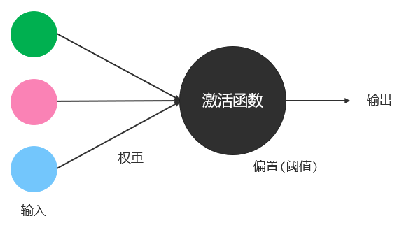

# AI 与大模型概述
## AI
AI（Artificial Intelligence，人工智能）指使机器像人类一样思考、学习和解决问题的技术。
## 神经网络
### 神经元和感知机模型
#### 神经元

#### 感知机模型
罗森布拉特提出感知机模型，用于模拟神经元。
在感知机模型中，输入类比神经元的树突、权重类比神经元的连接强度、激活函数类比神经元的突触。假设输入和激活函数都不变的情况下，我们可以通过调整权重值，得到不同的输出。
每个神经元上使用的**权重**和**阈值（又称偏置）**，统称为**参数**。单个神经元上的参数数量等于权重 + 1。

### 神经网络
由多个感知机叠加成多层感知机，构成神经网络。
每一层感知机都可以对输入的信息做整合处理并输出，输出的结果又作为下一层感知机的输入，这样层层传递得到最终的输出。
理论上，只要多层感知机模型足够宽、足够深，就能够解决足够复杂的任务。

## 大模型
通过代码实现的神经网络数学模型，称为模型。
这种具备学习能力。可以自主学习人们事先准备好并交给他的数据。在学习的过程中，它会自动设置神经网络中需要的参数。
通常会把参数规模在`100 B（1000 亿）`以上的模型称为**大模型**。
# 大模型应用开发
## 部署和调用大模型
### 本地部署大模型
1. 安装并启动 [Ollama](https://ollama.com/)。启动后默认监听 11434 端口。
2. 下载 [模型](https://ollama.com/search)。
3. 安装并启动模型到 Ollama：`ollama run 模型名`。启动后会进入交互模式，可与模型进行交互。
4. 停止对话并退出：交互模式下输入：`/bye`
### 调用大模型
[Ollama Blog](https://ollama.com/blog/thinking)
请求方式：POST
请求体：JSON。详见官方文档。
核心请求参数：
- model：指定当前要调用的模型名。
- messages：发送给模型的数据，模型会根据这些数据给出合适的响应。
	- role：
	- content：
- stream：调用方式。是否启用流式调用。默认使用阻塞式调用。
- enable_search：是否启用联网搜索。启用后，模型将联网搜索结果并作为参考信息。默认不开启。
## LangChain4J
### 环境搭建
JDK：JDK 17 及以上。

## Spring AI

