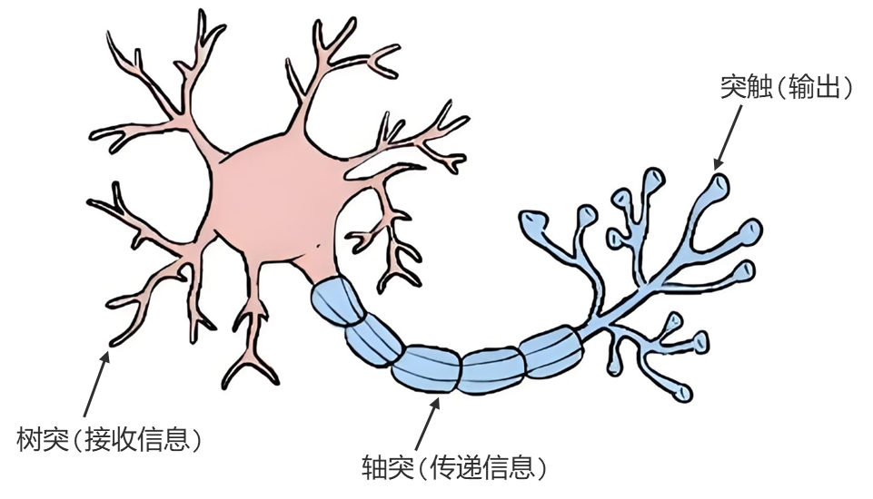
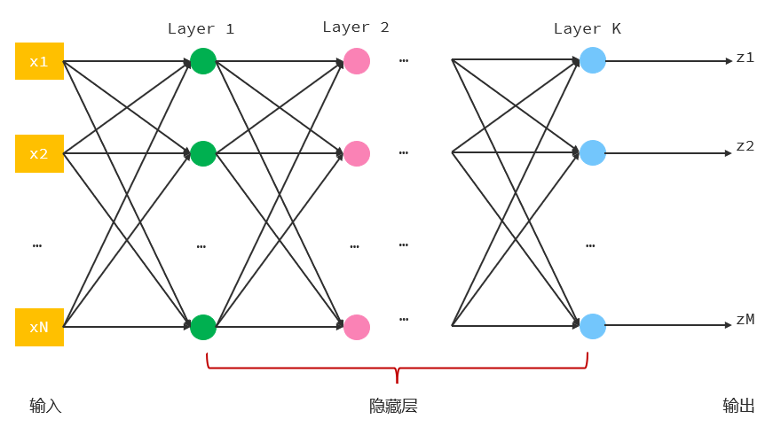
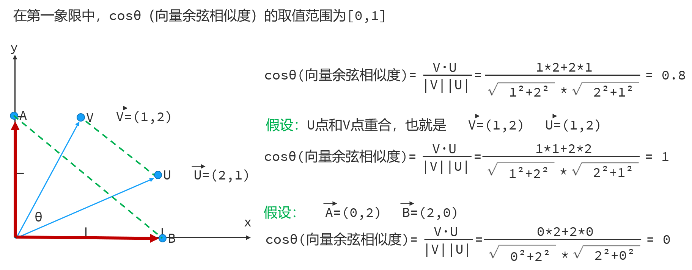

# AI 与大模型概述
## AI
AI（Artificial Intelligence，人工智能）指使机器像人类一样思考、学习和解决问题的技术。
## 神经网络
### 神经元和感知机模型
#### 神经元

#### 感知机模型
罗森布拉特提出感知机模型，用于模拟神经元。
在感知机模型中，输入类比神经元的树突、权重类比神经元的连接强度、激活函数类比神经元的突触。假设输入和激活函数都不变的情况下，我们可以通过调整权重值，得到不同的输出。
每个神经元上使用的**权重**和**阈值（又称偏置）**，统称为**参数**。单个神经元上的参数数量等于权重 + 1。

### 神经网络
由多个感知机叠加成多层感知机，构成神经网络。
每一层感知机都可以对输入的信息做整合处理并输出，输出的结果又作为下一层感知机的输入，这样层层传递得到最终的输出。
理论上，只要多层感知机模型足够宽、足够深，就能够解决足够复杂的任务。

## 大模型
通过代码实现的神经网络数学模型，称为模型。
这种具备学习能力。可以自主学习人们事先准备好并交给他的数据。在学习的过程中，它会自动设置神经网络中需要的参数。
通常会把参数规模在`100 B（1000 亿）`以上的模型称为**大模型**。
token 是大模型处理文本的基本单位，不同的分词器计算得出的 token 和 token 数可能不一致。

## RAG
RAG（Retrieval Augmented Generation，检索增强生成）通过检索外部知识库的方式增强大模型的生成能力。
### RAG 工作原理

当用户把问题发送给 AI 应用后，AI 应用会先根据用户的问题从知识库中检索对应的知识片段，得到知识片段后 AI 应用会结合用户的问题以及知识库中检索到的知识片段，组织要发送给大模型的消息。大模型接收到消息后，根据用户的问题、知识库检索到的知识片段以及自身已有的可生成知识，综合生成对应的结果后，响应给 AI 应用，最终由 AI 应用响应给用户。
### RAG 实现原理
#### RAG 存储

1. 准备数据，将存储到文档（`Document`）中。
2. 借助文本分割器（`Text Splitter`）把文档中的数据内容分割成一个个小文本片段（`Segments`）
3. 使用向量模型 `Embedding Model`（一种专用模型模型，擅长文本向量化）把一个个文本片段转换成向量（`Embeddings`）。
4. 把每个向量（`Embeddings`）和其对应的文本片段（`Segments`）一并存储到向量数据库（`Embedding Store`）中。
#### RAG 检索

1. 用户输入查询内容（`Query`）。
2. 查询内容（`Query`）送入向量模型（`Embedding Model`），生成查询向量（`Query Embedding`）。
3. 查询向量（`Query Embedding`）在向量数据库（`Embedding Store`）中进行`相似度搜索`，找到最相关的文本片段（`Relevant Segments`）。
4. 将原始查询内容（`Query`）和找到的相关文本片段（`Relevant Segments`）一起送入 `AI 大模型`（`Language Model`），模型生成最终响应。
### 知识库
知识库使用向量数据库（`Vector Database`）构建。向量数据库用以存储和检索高维向量（`High-dimensional Vectors`）。按向量相似性索引进行搜索。
- `Milvus` 面向高性能向量检索设计，支持大规模、高维向量数据。
- `Chroma` 多用于本地或轻量级场景，注重快速向量存储和查询。
- `MySQL` 原生不支持高效向量检索。`MySQL 8.0+` 引入了 `VECTOR` 类型支持，但功能有限。它可以存储向量（`FLOAT/DOUBLE` 数组）。支持使用`L2`进行简单的相似度评估，但性能无法与专门向量数据库相比。适合数据量小、检索需求不高的场景，不适合大规模向量相似检索。
- `PostgreSQL` 提供 `pgvetor` 用于向量存储。
- `Redis` 原生不支持向量存储和检索，但可以通过模块实现。
	- `Redis Vector（Redis 7+）`：支持向量存储和近似最近邻（ANN）搜索。
	- `RedisAI`：用于存储张量（tensor）和运行 AI/ML 模型推理，可存储向量，但本身不提供高性能向量索引和检索。
	- `RediSearch（2.6+）`：支持文本、数字、标签索引，同时也支持向量字段和 ANN 检索，适用于文本/元数据+向量混合检索的场景。
- `Elasticsearch 7.3+` 开始支持 `dense_vector` 类型，可以存储向量，支持 `cosine / dot / L2` 评估相似度，适合中等规模向量检索。
### 相似度
评估两个向量间语义相似度的指标。两个向量间空间距离越小（向量越接近），语义越相似。
#### 欧氏距离（L2）
#### 内积（Dot Product）
#### 余弦相似度（Cosine Similarity）
向量的余弦相似度用于指标坐标系中两个语义间的相似情况，值为 `cosθ`。

任意非零向量 `v` 和 `u` 之间存在夹角 `θ`，则向量的余弦为此夹角 `θ` 的 `cos(θ)` 值。该值等于`向量内积`除以`向量模长的乘积`。向量内积为两个向量对应坐标的乘积和；向量的模长为单个向量所有坐标的根号下平方和。
在第一象限中，余弦值范围为 `[0,1]`。当余弦值为 `0` 时，向量正交，两向量间距离最远；当余弦值为 `1` 时，两向量间距离最近。
在任意象限中，余弦值的数学范围为 `[−1,1]`。
定义余弦距离 `d(u,v) = 1 - cosθ`。余弦距离越小，语义越相似。
- d = 0：余弦相似度 `cosθ` 为 `1`，两向量间语义最相似。
- d = 1：余弦相似度 `cosθ` 为 `0`，两向量间语义最不相关。
- d = 2：余弦相似度 `cosθ` 为 `-1`，两向量间语义最相反。

# 大模型应用开发
## 部署和调用大模型
### 本地部署大模型
1. 安装并启动 [Ollama](https://ollama.com/)。启动后默认监听 11434 端口。
2. 下载 [模型](https://ollama.com/search)。
3. 安装并启动模型到 Ollama：`ollama run 模型名`。启动后会进入交互模式，可与模型进行交互。
4. 停止对话并退出：交互模式下输入：`/bye`
5. Ollama 常用命令
	- `ollama run <模型名>`：运行指定模型（若不存在则自动下载）
	- `ollama list`：查看本地已下载的模型列表
	- `ollama rm <模型名>`：删除本地模型
	- `ollama show <模型名> --modelfile`：查看模型配置
	- `ollama show <模型名> --parameters`：查看运行参数
### 调用大模型
调用文档：[Ollama Blog](https://ollama.com/blog/thinking)
请求方式：POST
请求体：JSON。详见官方文档。
核心请求参数（以`阿里云百炼大模型服务平台`为例）：
- model：指定当前要调用的模型名。
- messages：发送给模型的数据，模型根据发送的数据给出合适的响应。
	- role：本条消息的类型（角色）
		- user：用户发送的消息
		- system：系统消息，可设定模型回复风格等。
		- assistant：模型响应的消息。
	- content：具体消息内容。
- stream：调用方式。是否启用流式调用。默认使用阻塞式调用。
- enable_search：是否启用联网搜索。启用后，模型将联网搜索结果并作为参考信息。默认不开启。
核心响应参数（以`阿里云百炼大模型服务平台`为例）：
- choices：模型生成的内容**数组**，包含一或多条内容。
	- message：本次模型输出的消息内容。
	- finish_reason：本次输出消息的结束原因。
		- stop：输出完毕，自然结束
		- length：生成内容过长
	- index：当前内容在 choices 数组中的索引。
- usage：本次会话过程中使用的 token 信息。
	- prompt_tokens：用户的输入转换成 token 的个数。
	- completion_tokens：模型生成的回复转换成 token 的个数。
	- total_tokens：用户输入和模型生成的总 token 个数。
- created：本次会话被创建时的时间戳。
- model：本次会话使用的模型名称。
## [LangChain4J](https://docs.langchain4j.dev/)
### 集成
#### 非 SpringBoot 集成
1. 添加 Maven 依赖。JDK 17 及以上。
	```xml
	<!-- LangChain4J OpenAI -->
	<dependency>
	    <groupId>dev.langchain4j</groupId>
	    <artifactId>langchain4j-open-ai</artifactId>
	    <version>1.8.0</version>
	</dependency>
	```
2. AI 配置类。其中，`AI_API_KEY` 配置到环境变量。
	```Java
	@Slf4j
	@Configuration
	public class AiConfig {
	    /**
	     * 模型请求 url（阿里云百炼大模型服务平台为例）
	     */
	    @Value("https://dashscope.aliyuncs.com/compatible-mode/v1")
	    private String baseUrl;
	    
	    /**
	     * apiKey
	     */
	    @Value("${AI_API_KEY}")
	    private String apiKey;
	
	    /**
	     * 模型名称
	     */
	    @Value("modelName")
	    private String modelName;
	
	    private OpenAiChatModel openAiChatModel;
	
	    /**
	     * 初始化 AI 模型
	     */
	    @PostConstruct
	    private void initAi() {
	        openAiChatModel = OpenAiChatModel.builder()
	                                         .baseUrl(baseUrl)
	                                         .apiKey(apiKey)
	                                         .modelName(modelName)
	                                         // 输出请求日志
	                                         .logRequests(true)
	                                         // 输出响应日志
	                                         .logResponses(true)
	                                         .build();
	    }
	
	    /**
	     * 向 AI 提问
	     *
	     * @param question question
	     * @return answer
	     */
	    public String chat(String question) {
	        return openAiChatModel.chat(question);
	    }
	}
	```
#### SpringBoot 集成
1. 添加 Maven 依赖。JDK 17 及以上。
	```xml
	<!-- LangChain4J -->  
	<dependency>  
	    <groupId>dev.langchain4j</groupId>  
	    <artifactId>langchain4j-spring-boot-starter</artifactId>  
	    <version>1.8.0-beta15</version>  
	</dependency>  
	<!-- LangChain4J OpenAI -->  
	<dependency>  
	    <groupId>dev.langchain4j</groupId>  
	    <artifactId>langchain4j-open-ai-spring-boot-starter</artifactId>  
	    <version>1.8.0-beta15</version>  
	</dependency>
	```
2. 编辑 `application.yaml` 配置文件
编辑 `src/main/resources/application.yaml` 文件，配置大模型信息。此处使用阻塞式调用。
```yaml
langchain4j:
  open-ai:
    chat-model:
      base-url: https://dashscope.aliyuncs.com/compatible-mode/v1
      # 写入环境变量
      api-key: ${AI_API_KEY}
      model-name: qwen-plus
      # 输出请求日志
      log-requests: true
      # 输出响应日志
      log-responses: true
```
1. 注入 `OpenAiChatModel` 对象
`langchain4j-open-ai-spring-boot-starter` 会自动向 IOC 容器中注册`OpenAiChatModel` 对象，供需要时注入。
```Java
@SpringBootTest  
public class AiTest {  
    @Resource  
    private OpenAiChatModel openAiChatModel;  
  
    @Test  
    void AiChatTest() {  
        String response = openAiChatModel.chat("Hello World");  
    }  
}
```
### AiServices 工具类
#### 声明接口
```Java
public interface ArtificialIntelligenceService {  
  
    /**
     * 向 AI 提问
     *
     * @param question question
     * @return answer
     */
     String chat(String question);
}
```
#### 创建动态代理
在声明的接口方法上添加注解：`@AiService`，LangChain4j 会扫描所有标记有该注解的接口，然后自动创建这些接口的代理对象并注册到 IOC 容器中。
```Java
@AiService(wiringMode = AiServiceWiringMode.EXPLICIT, chatModel = "openAiChatModel")
public interface OpenAiService {

    /**
     * 向 AI 提问
     *
     * @param question question
     * @return answer
     */
     String chat(String question);
}
```
##### @AiService 注解
标记在接口上。可选参数如下：
- wiringMode：指定装配模式。
	- `AiServiceWiringMode.AUTOMATIC`：默认值。自动装配。
	- `AiServiceWiringMode.EXPLICIT`：手动装配。
- chatModel：指定需要使用的模型对象容器名。IOC 容器中 Bean 对象的容器名默认类名首字母小写。缺省时触发自动装配。
- streamingChatModel：指定需要使用的流式模型对象容器名。缺省时触发自动装配。
- chatMemory：指定需要使用的会话记忆存储对象容器名。缺省时触发自动装配。
- chatMemoryProvider：指定需要使用的会话记忆隔离存储对象容器名。缺省时触发自动装配。
#### 注入声明的接口并使用
```Java
@SpringBootTest
public class AiTest {
    @Resource
    private OpenAiService openAiService;
    
    @Test
    void AiChatTest() {
        String response = openAiService.chat("Hello World");
    }
}
```
### 流式调用
基于 `AiServices` 工具类和 `webflux`。
#### 添加依赖
```xml
<!-- SpringBoot Reactive -->
<dependency>
    <groupId>org.springframework.boot</groupId>
    <artifactId>spring-boot-starter-webflux</artifactId>
</dependency>

<!-- LangChain4J Reactor -->
<dependency>
    <groupId>dev.langchain4j</groupId>
    <artifactId>langchain4j-reactor</artifactId>
    <version>1.8.0-beta15</version>
</dependency>
```
#### 流式调用配置
编辑 `src/main/resources/application.yaml` 文件，配置大模型信息。指定使用流式模型对象。
```yaml
langchain4j:
  open-ai:
	# 指定使用流式模型对象
    streaming-chat-model:
      base-url: https://dashscope.aliyuncs.com/compatible-mode/v1
      # 写入环境变量
      api-key: ${AI_API_KEY}
      model-name: qwen-plus
      # 输出请求日志
      log-requests: true
      # 输出响应日志
      log-responses: true
```
指定 `@AiService` 注解中的 `streamingChatModel` 参数。修改接口中方法声明的返回值类型为：`Flux<T>` 以支持流式调用。
```Java
@AiService(wiringMode = AiServiceWiringMode.EXPLICIT,  
        streamingChatModel = "openAiStreamingChatModel")  
public interface OpenAiService {  
  
    /**  
     * 向 AI 提问  
     *  
     * @param question question  
     * @return answer     
    */
    Flux<String> chat(String question);  
}
```
#### 接口定义
```Java
@Slf4j
@RestController
@RequestMapping("/ai/open_ai")
public class OpenAiController {
    @Resource
    private OpenAiService openAiService;
  
    @PostMapping("/chat")
    public Flux<String> chat(@RequestParam String question) {
        Flux<String> flux = openAiService.chat(question);
        return flux;
    }
}
```
###  系统提示
`系统提示（System Prompt）`是大模型中用于设定模型角色、行为边界和对话规则的最高优先级指令。它属于`提示工程（Prompt Engineering）`中的一种基础控制手段。
核心作用是约束和引导模型的输出行为。
#### @SystemMessage 注解
标记在 `@AiService` 注解的接口中定义的方法声明上，用于设定系统提示词。
```Java
@AiService
public interface OpenAiService {

    /**
     * 向 AI 提问
     *
     * @param question question
     * @return answer
     */
     @SystemMessage(value = "你是一名 Java 后端开发者")
     Flux<String> chat(String question);
}
```
- value：指定系统提示词，不能为空。
- fromResource：从指定的文件加载系统提示词。文件读取根目录为资源根目录：`src/main/resources`。
	- 如：`@SystemMessage(fromResource = "prompt/SystemPrompt.md")`指示读取 `src/main/resources/prompt/SystemPrompt.md`文件中的内容并加载到系统提示。
#### @UserMessage 注解
标记在 `@AiService` 注解的接口中定义的方法声明上，用于预设用户角色提示词。可在提示词字符串中，通过 `{{param}}` 的方式，动态获取用户传递的消息。其中，`param` 可自定义命名，指代传递的消息，可在方法参数中通过 `@V("param")` 指定和关联。
```Java
@AiService
public interface OpenAiService {

    /**
     * 向 AI 提问
     *
     * @param question question
     * @return answer
     */
     @UserMessage(value = "你是一名 Java 后端开发者。{{param}}")
     Flux<String> chat(@V("param") String question);
}
```
### 会话记忆与隔离
langchian4j 提供接口 `ChatMemory`，能够自动管理会话记忆，并在对话中携带会话记忆消息一并发送给大模型。
langchian4j 提供接口 `ChatMemoryProvider`，能够自动管理当前应用中所有的会话记忆对象，并根据 `memoryId` 从存储所有会话记忆对象的容器中匹配对应的会话记忆对象，实现会话记忆隔离。其中，`memoryId` 值取自 `@AiService` 定义的方法中，使用 `@MemoryId` 注解标记的方法参数。
#### ChatMemory 接口
#### ChatMemoryProvider 接口
`ChatMemoryProvider` 接口提供一个必须实现的 `get()` 方法。如果从存储会话记忆对象的容器中没有找到指定 `memoryId` 的 `ChatMemory` 对象，`langchian4j` 则会调用 `ChatMemoryProvider` 对象的 `get()` 方法，获取一个新的 `ChatMemory`对象。
#### TokenWindowChatMemory 实现类
`ChatMemory` 接口的实现类。
#### MessageWindowChatMemory 实现类
是 `ChatMemory` 接口的实现类。使用 `ChatMemoryStore` 存储和管理会话记忆。`ChatMemoryStore` 是一个接口，默认使用 `SingleSlotChatMemoryStore` 实现类实现会话记忆的存储和管理。在该实现类中，使用 `List<ChatMessage> messages` 在内存中存储会话记忆。
可通过自定义实现 `ChatMemoryStore` 实现类，持久化存储会话记忆。
自定义实现`ChatMemoryStore` 实现类后，需要在 `ChatMemory` 接口配置类中，通过 `.chatMemoryStore()`指定自定义的实现类。
##### ChatMemoryStore 实现类
实现 `ChatMemoryStore` 接口并重写接口定义的方法，持久化存储和管理会话记忆。以 `Redis` 持久化为例，自定义 `RedisChatMemoryStore` 实现类：
```Java
public class RedisChatMemoryStore implements ChatMemoryStore {
    @Resource
    private RedisTemplate<String, List<ChatMessage>> redisTemplateForChatMessageList;
  
    /**
     * 获取会话消息列表
     *
     * @param memoryId 会话 id
     * @return List<ChatMessage>
     */
    @Override
    public List<ChatMessage> getMessages(Object memoryId) {
    String messagesObject = redisTemplateForChatMessageList.opsForValue().get(memoryId.toString());
    return ChatMessageDeserializer.messagesFromJson(messagesObject);
}
  
  
    /**  
     * 新增或更新会话消息  
     *  
     * @param memoryId        会话 id  
     * @param chatMessageList 会话消息列表  
     */  
    @Override  
    public void updateMessages(Object memoryId, List<ChatMessage> chatMessageList) {
	    redisTemplateForChatMessageList.opsForValue().set(memoryId.toString(), ChatMessageSerializer.messagesToJson(chatMessageList));
    }  
  
    @Override  
    public void deleteMessages(Object memoryId) {  
        redisTemplateForChatMessageList.delete(memoryId.toString());  
    }  
}
```
#### 会话记忆配置
##### ChatMemory 配置
```Java
@Slf4j  
@Configuration  
public class AiConfig {  
    /**  
     * 最大会话记录保存数  
     */  
    private static final int MAX_MESSAGES = 32;  
  
    @Bean  
    public ChatMemory chatMemory() {  
        return MessageWindowChatMemory.builder()  
                                      .maxMessages(MAX_MESSAGES)  
                                      .build();  
    }  
}
```
##### ChatMemoryProvider 配置
配置 `ChatMemoryProvider` 获取管理的会话。
```Java
@Slf4j
@Configuration
public class AiConfig {
    /**
     * 最大会话记录保存数
     */
    private static final int MAX_MESSAGES = 32;
    
    @Resource
    private RedisChatMemoryStore redisChatMemoryStore;
    
    @Bean
    public ChatMemoryProvider chatMemoryProvider() {
        return memoryId -> MessageWindowChatMemory
        .builder()
        .id(memoryId)
        .maxMessages(MAX_MESSAGES)
        .chatMemoryStore(redisChatMemoryStore)
        .build();
    }
}
```
配置 `@AiService` 标记的方法。其中：
- `@MemoryId`：标记在方法参数上，指示会话隔离时需要的 memoryId。
- `@UserMessage`：标记在方法参数上，指示用户消息。
```Java
@AiService
public interface OpenAiService {

    /**
     * 向 AI 提问
     *
     * @param memoryId memoryId
     * @param question question
     * @return answer
     */
     @SystemMessage(fromResource = "prompt/SystemPrompt.md")
     Flux<String> chat(@MemoryId String memoryId, @UserMessage String question);
}
```
### LangChain4J 实现 RAG
#### 依赖 [langchain4j-easy-rag](https://docs.langchain4j.dev/tutorials/rag/#easy-rag)
`langchain4j-easy-rag`是 `LangChain4J` 提供的 `GAG` 快速实现方案。提供基于内存的向量数据库和向量模型供开发使用。
```xml
<dependency>
    <groupId>dev.langchain4j</groupId>
    <artifactId>langchain4j-easy-rag</artifactId>
    <version>1.8.0-beta15</version>
</dependency>
```
#### RAG 存储
LangChain4j 提供 `ClassPathDocumentLoader` 类，用于将指定目录下的文档加载到内存中并构造为文档。
`langchain4j-easy-rag` 提供有可操作基于内存的向量数据库的类：`InmemoryEmbeddingStore`，用于构造向量数据库操作对象，操作一个 `langchain4j-easy-rag` 提供的、基于内存的向量数据库。
```Java

```


## Spring AI
