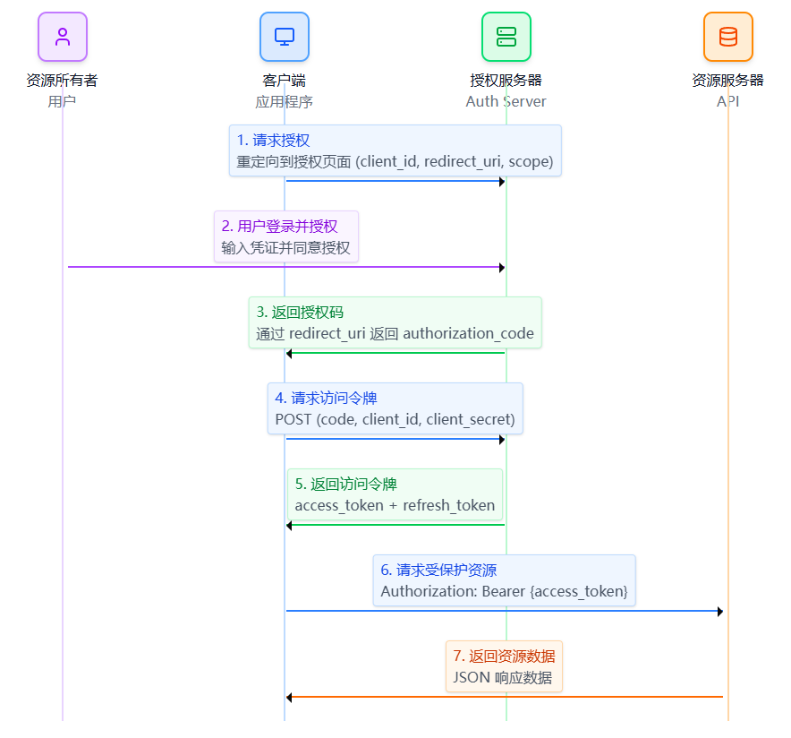

# OAuth 2.0 概述
[OAuth 2.0](https://apifox.com/help/auth/oauth2/) 是一种开放标准的授权协议，用于授权第三方应用程序访问受保护的资源，而无需提供用户的用户名和密码。
它允许用户在不直接向第三方应用程序披露其凭据的情况下，授权其访问受保护资源。
OAuth 2.0 被广泛用于 Web 和移动应用程序中，以提供安全的授权机制。
## 角色
### 资源所有者（Resource Owner）
通常是用户。拥有受保护的资源如图片、个人资料等。
### 客户端（Client）
第三方应用程序，想要访问`资源所有者`的受保护资源。
### 授权服务器（Authorization Server）
负责认证`资源所有者`并授权`客户端`访问资源的服务器。
### 资源服务器（Resource Server）
存储受保护资源的服务器，提供访问受保护资源的 API。
## 协议设计思想
客户端（第三方应用程序）永远不应该接触到用户密码。需要让资源所有者（用户）跳转到授权服务器，由授权服务器统一负责登录与授权。
# 授权流程
OAuth 2.0 协议通过授权流程（Authorization Flow）来实现授权。
[OAuth 2.0 授权流程图 – Figma Make](https://www.figma.com/make/qxxEUqsnA86ERs5tezHEim/OAuth-2.0-%E6%8E%88%E6%9D%83%E6%B5%81%E7%A8%8B%E5%9B%BE?node-id=0-1&p=f&t=ufO6LjOCc8j9wcEU-0&fullscreen=1)
[什么是 OAuth 2.0 - Apifox 帮助文档](https://docs.apifox.com/doc-5734564)
[使用 Google 谷歌 OAuth 2.0 服务登录第三方网站，图文教程](https://apifox.com/apiskills/how-to-use-google-oauth2/#%E4%BB%80%E4%B9%88%E6%98%AF-oauth-20)
## 授权码授权流程（Authorization Code Grant）
客户端重定向用户到授权服务器，用户登录并授权后，授权服务器返回授权码给客户端，客户端使用授权码与客户端凭证交换访问令牌。

## 隐式授权流程（Implicit Grant）
用于在浏览器中直接从客户端获得访问令牌，通常用于 Web 前端应用。