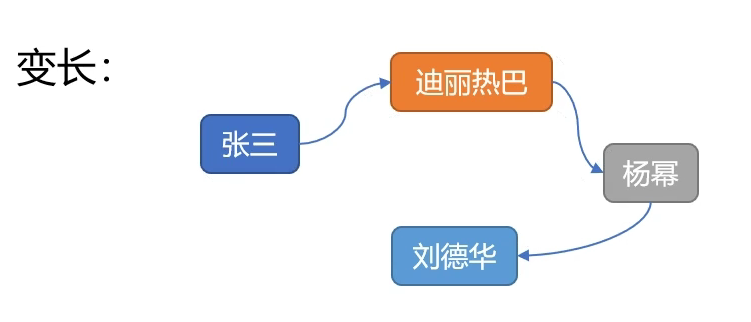
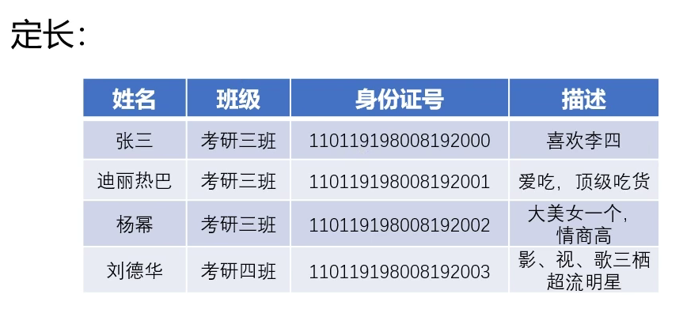
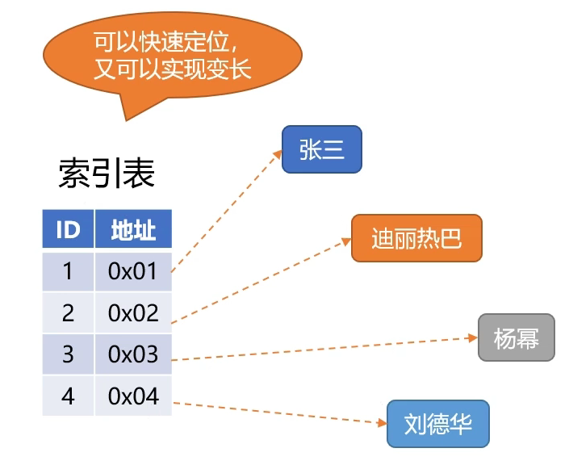
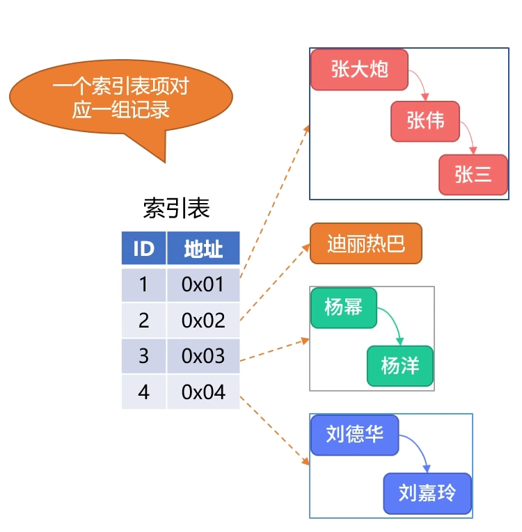

[4.02.文件的逻辑结构_哔哩哔哩_bilibili](https://www.bilibili.com/video/BV15W4y1M7sR?vd_source=32d7b7aca593de01e7de9c2be4a87152&p=2&spm_id_from=333.788.videopod.episodes)

# 文件系统基础
## 文件的概念
### 文件的定义
文件是以计算机硬盘为载体的、存储在计算机上的信息集合。
### 文件的属性
文件的属性是描述文件状态的一组信息，如文件名称、标识符、文件类型、文件大小、文件存放位置、文件创建和修改日期等。
### 对文件相关的操作
创建文件、读文件、写文件、文件重定位（寻址）、删除文件、截断文件、打开和关闭文件等。
## 文件的结构
### 文件的逻辑结构
#### 无结构文件（流式文件）
无结构文件没有具体的结构，文件内容遍历读取，以字节（Byte）为单位。
#### 有结构文件（记录式文件）
- 顺序文件：存储的每条数据（称为**记录**）之间有序。
	- 可变长顺序文件：**结构类似链表**，链表中每个节点称为记录。受限于链表的数据结构，可变长顺序文件无法快速定位第 i 个记录。
		- 
	- 定长顺序文件：**结构类似定长数组**，数组中元素称为记录。受限于数组的数据结构，定长顺序文件无法快速增加或删除记录。
		- 
- 索引文件：存储的每条记录都具有索引。每条记录具有的索引，存储在一个定长数组结构的索引表中。索引表和记录统一位于索引文件中。索引文件可以**快速定位**和**实现变长**（初始化一个较大的定长数组结构作为索引表，或当定长数组容量满时进行**扩容**。即重新初始化一个更大的定长数组结构作为新的索引表，原有数据复制到新的索引表中）。
	- 
- 顺序索引文件：索引文件每个记录中存储一个顺序文件，共同组成顺序索引文件。
	- 
- 直接文件或散列文件（Hash File）：
### 文件的物理结构
## 文件共享和保护
# 文件系统实现
## 文件系统层次结构
## 目录实现
## 文件实现
