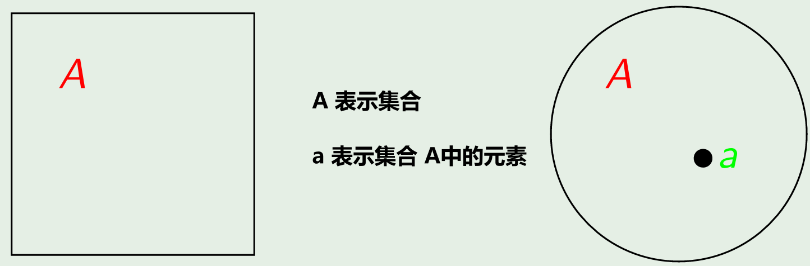

# 第一章 集合论基础
## 1.1 集合概述
### 1.1.1 集合的定义
#### 朴素集合论定义
指定范围内满足给定条件的所有对象 m 聚集在一起构成集合 M。其中，每一个对象 m 称为这个集合 M 的元素。
- 集合是一组对象。
- 集合是将我们感知或思维中的确定且各不相同的对象 m 聚集汇总为一个整体，这个整体记为集合 M。
#### 公理化集合论定义
朴素集合论因直观简单，在早期被广泛使用，但后来被发现存在严重问题，尤其是罗素悖论的出现，迫使数学家们转向更严格的公理化集合论。
公理化集合论通过一组严格的、逻辑严谨的公理限制集合的定义方式，用公理明确哪些操作是合法的，使集合的定义具有形式化严谨性：所有集合必须通过公理生成。
**ZF 公理化集合论**：外延公理 + 空集存在公理 + 无序对公理 + 并集公理 + 幂集公理 + 无穷公理 + 替换公理 + 正则公理 + 选择公理。
### 1.1.2 集合的表示
#### 集合的数学符号
- 通常情况下，用带或不带下标的大写英文字母表示集合：*A*, *B*, *C*, ···, *A*1, *B*1, *C*1, ···
- 通常情况下，用带或不带下标的小写英文字母表示元素：*a*, *b*, *c*, ···, *a*1, *b*1, *c*1, ···
- 常用集合的数学符号表示：
	- 自然数集合：N
	- 整数集合：Z
	- 有理数集合：Q
	- 实数集合：R
- 若 a 是集合 A 中的元素，则称 a 属于 A，记为：a∈A
- 若 a 不是集合 A 中的元素，则称 a 不属于 A，记为：a∉A
#### 集合的表示方法
##### 枚举法
列出集合中的全部元素或仅列出一部分元素，其余用省略号（···）表示。
- A = {a,b,c,d}
- B = {2,4,6,8,10,···}
##### 叙述法
通过刻画集合中元素所具备的某种性质或特性表示一个集合，数学形式为：P={x|P(x)}。其中，P 表示集合，x 表示此集合中的任意一个元素，P(x) 表示集合中的元素具备的性质或特性。
- A = {x|x是英文字母中的元音字母}
- B = {x|x∈Z, x<10}
- C = {x|x=2k,k∈N}
##### 文氏图
利用平面上的点，用图解的方法表示集合。一般使用平面上的方形或圆形表示一个集合，而使用平面上的一个小圆点来表示该集合中的一个元素。

#### 基数、有限集、无限集
集合 A 中的元素个数称为集合的基数，记为：|A|
- 若一个集合的基数是有限的，称该集合为有限集。
	- `A={a,b,c}, |A|=3`：表示在集合 A 中，集合的基数为 3。
- 若一个集合的基数是无限的，称该集合为无限集。
### 1.1.3 集合间关系
#### 空集
不含任何元素的集合叫做空集（empty set），记作：∅。满足： ∅ = {x|x≠x}。
如：设 A = {x|x∈R, x2<0}, 则 A = ∅。
##### 空集的性质
- |∅| = 0。即空集的基数是0。
- |{∅}| = 1。这里指当空集作为此集合中的一个元素时，此集合的基数是1。
- 空集是**绝对唯一**的，有且仅有一个空集。
#### 全集
在某个具体的研究范围内考虑的所有对象的集合叫做全集（universal set），记作 U 或 E。在文氏图中一般使用方形表示全集。
##### 全集的性质
- 全集是**相对唯一**的。在不同的研究范围内，全集是不同的。在同一个研究范围内，全集是唯一的。
#### 子集
##### 子集的性质
#### 真子集
##### 真子集的性质
### 1.1.4 集合中元素的基本性质
- 集合中的元素是**无序**的。如 {1,2,3,4} 与 {2,3,1,4} 相同。
- 集合中的元素是**不同**的，如果一个集合中出现多个互相相同元素，则把这些相同的元素视作同一个元素。如 {1,2,3,4,1,2,3,4} 与 {1,2,3,4} 相同。
- **外延公理**：当且仅当两个集合 A 和 B 的元素完全相同时，两个集合 A 和 B 相等，记作：A = B。否则 A 和 B 不相等，记作：A ≠ B。