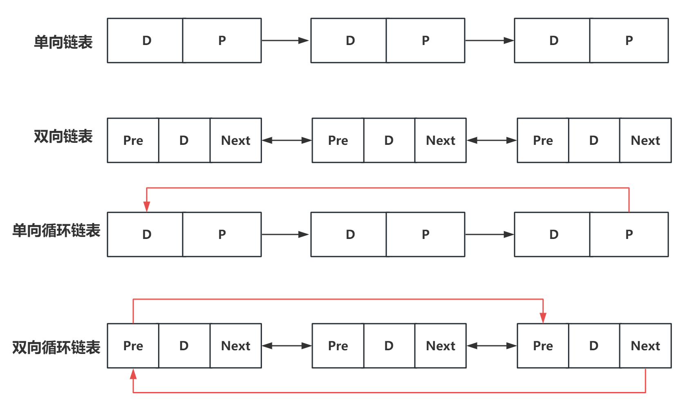

# C 语言概述
C语言是一门**区分大小写**的编程语言。
## 信息、进制和容量
### 信息
信息是对事物状态的描述，它可以消除事物的不确定性。而数据是信息的载体。
在计算机科学中，度量信息的最小单位是**比特（bit）**。bit 只有两种可能的状态或取值：0/1。
在计算机底层，所有信息最终都是一长串由0和1组成的二进制序列，这个二进制序列称为**机器数**。
人类视角中理解的信息被称为**真值**，编码规则就是建立**机器数**和**真值**之间的映射方式。
### 进制
#### 二进制
二进制数中，每一位的权重是2的幂次方，从右向左从0次幂开始。
#### 十进制
将值为1的位对应的权重相加，即得到二进制数的十进制值。例如，二进制 1010 转换为十进制是：1 * 2³ + 0 * 2² + 1 * 2¹ + 0 * 2⁰ = 8 + 0 + 2 + 0 = 10。
十进制数转换为二进制需不断除以2并记录余数。
右移 k 位：除以 `10^k`，结果取整。
截取低 k 位：对`10^k`取模。
#### 八进制
八进制逢八进一。
每一位八进制数对应三位二进制数。
八进制字面值包含数字 0~7，在C语言中必须以 0 开头。
#### 十六进制
十六进制逢十六进一，用0-9和A-F表示10-15。
每一位十六进制数对应四位二进制数。
十六进制字面值包含数字 0~9 和字母 a~f（或A~F），在C语言中必须以 0x （或0X）开头。
### 容量
- 字节（Byte）：`1 Byte = 8 bit`。
	- 字节是内存寻址的最小单元。
## 开发环境
### 编译器
- Microsoft Visual C++（MSVC）：微软官方推出的 C/C++ 编译器套件，也是 Windows 平台下开发原生应用的主流工具，常与 Visual Studio 集成环境搭配使用，支持从桌面应用到游戏、驱动程序等多种 Windows 开发场景。
- MinGW：适用于 Windows 系统的 GCC 编译器。
### 编辑器
- Visual Studio Code
### 集成开发环境
集成开发环境（IDE，Integrated Development Environment）是提供一整套解决方案的软件，它集成了如文本编辑器、语法检查器、编译器、调试器和其他写代码所需要的工具，极大简化和方便了编程过程。
- Visual Studio
- CLion
## 执行过程
1. **预处理器**对C语言源文件（`.c 文件`）进行预处理，生成预处理后文件（`.i 文件`）。
	- 执行源文件中的预处理指令。
	- 去除（忽略）代码中的所有注释。
2. 编译预处理后文件。
	- 当编译到变量定义的语句时，编译器识别变量的类型、变量名等信息。供程序运行时在内存空间中为变量分配实际的内存区域。
## 内存布局
### 内存的逻辑划分
从低地址到高地址：
1. 代码段（Text Segment）：存放程序指令。只读、可执行。
2. 数据段（Data Segment）：存放全局变量和静态变量。已初始化的在 `.data`，未初始化的在 `.bss`
3. 堆区（Heap）：存放动态分配的内存，起始在数据段之后，向高地址增长。由程序员或内存管理器控制分配和释放。
4. 栈区（Stack）：存放函数局部变量、参数、返回地址，通常位于高地址，向低地址增长。由编译器自动管理，函数调用时入栈，函数返回时出栈。
### 数据在内存中的存储期限
#### 自动存储期限
数据存储在栈`（Stack）`上，如局部变量。这些变量在对应函数被调用时分配内存空间，并在函数返回时随着栈帧的出栈而销毁。变量只在声明它们的函数调用期间生效。
栈帧的大小在编译时期就已经确定，意味着栈区域存储的数据在编译期就已经确定了它的大小。
#### 静态存储期限
数据存储在``数据段``中，如全局变量和字符串字面值（存储在数据段的只读区域）。这些数据在程序启动时初始化，并在整个程序运行期间持续存在，直到程序结束。
#### 动态存储期限
数据存储在堆`（Heap）`上，由程序员在运行时手动为其申请空间并由程序员手动控制生命周期。手动分配内存、手动释放内存。
### 堆空间
存储由程序员调用内存分配函数（如malloc、free等）手动创建的内容空间。堆空间的内存完全依赖程序员手动管理。
# 语法
## 注释（comment）
注释会在编译器进行编译时被自动忽略，任何注释都不会影响程序的输出或运行。
- 单行注释：使用双斜杠`//`开头，直到该行结束的所有内容视为`单行注释`。
- 多行注释：从`/*`开始到`*/`结束，中间包括的部分视为`多行注释`，也称`块注释`。
## 关键字和标识符
### 关键字（keyword）
在语法标准中规定的、在代码中具有特殊意义和用途的单词称之为关键字。
关键字不能被程序员作为标识符使用。
C语言中绝大多数关键字是小写的英文单词。
#### 预处理指令
以 # 号开头的指令称为预处理指令。
包含头文件：`#include`
宏定义：`#define`
### 标识符（identifier）
在代码中由程序员自行定义的如变量名、函数名等字符串称之为标识符。
标识符可以由字母、数字或下划线组成，但第一个字符必须是大小写字母或下划线`_`。
## 运算符和表达式
### 语句（statement）
代码中一个完整的、可以执行的步骤。
#### 简单语句
以分号`;`结尾。
#### 复合语句
以代码块`{}`结尾。
### 运算符
#### 算术运算符
加`+`、减`-`、乘`*`、除`/`、取余（取模）`%`
如果除运算符`/`的两个操作数都是整数，则结果为**向零取整**的整数。
取模运算`%`要求两个操作数必须均为整数（其它算术运算符可以用于浮点数），因为取模运算就是取余数，如果允许出现小数，那就没有余数的概念。
#### 赋值运算符
赋值运算符：=
复合赋值运算符：`+=`、`-=`、`*=`、`%=`。`i+=10`等价于`i=i+10`
自增运算符：++。`i++`等价于`i=i+1`，且i的值是自增前的i，然后修改`i`的值令其+1，然后表达式结束，`i`严格等于`i+1`。
自减运算符：--
#### 关系运算符
关系运算符用于比较两个值的大小，根据比较的结果返回0/1。
1表示true，0表示false。
等于：==
大于：>
小于：<
大于等于：>=
小于等于：<=
#### 逻辑运算符
非零值为真（true），零值为假（false）。
短路：如果左操作数的值已经足以得出结果，右操作数不必执行时，不执行右操作数。
短路逻辑与：&&
短路逻辑或：||
逻辑非：!
#### 三目运算符
条件运算符：`condition ? expression1 : expression2`
- condition：一个返回布尔值的条件表达式。
- expression1：如果condition为真（非0），则计算并返回此表达式的值。
- expression2：如果condition为假（0），则计算并返回此表达式的值。
#### 取地址运算符
&。其后跟一个变量名，意为获取此变量的内存地址值（是一个指针类型的值，需要用指针变量存储）。
#### 解引用运算符
`*`。其后跟一个指针变量名。意为获取此指针变量指向地址中的变量值。
解引用一个空指针（指针变量存储NULL）会导致程序崩溃。
### 表达式（expression）
由变量、常量（操作数）和运算符组成的序列，用于计算值、赋值、函数调用等。
## 头文件
以`.h`为后缀的文件，用于声明函数、结构体类型、变量等。通过`包含头文件指令 #include`引入头文件。预处理阶段，头文件中的内容会被处理到 `#include 指令`所在的位置，使得编译器在编译代码时可以访问被包含的头文件中定义的所有函数和变量。
## 常量、变量和数据类型
根据数据内容是否可以被修改，C语言中存储和操纵的数据对象分为常量和变量。
数据类型决定了变量可以存储哪种类型的数据，以及存储这种数据会占用多少内存空间等。
### 常量
指在程序运行过程中，其内容不会发生任何改变的的数据。用于给**变量**赋值。
#### 字面值常量
整数的字面值常量默认情况下为 int 类型。参与表达式运算时会默认将 `int` 小的整型（`char`、`short` 等）提升为 `int`（或 `unsigned int`）。
浮点数的字面值常量必须包含小数点或指数（即E或者e，表示乘以10的n次方）。默认情况下，浮点数字面值常量为 double 类型。

#### 符号常量和宏定义
C语言当中通过预处理指令`宏定义`来实现符号常量。符号常量在预处理阶段会执行文本替换操作，将符号常量替换为字面值常量。
定义符号常量：`#define 标识符号常量的变量名 字面值常量`
### 变量
指在程序运行过程中，允许其内容发生变化的数据。
变量是内存中存储数据的存储单元，即内存中某个位置所在的内存区域。该内存区域具有一个标识符指代名字，这个名字称作**变量名**，这片区域中存储的数据称做**变量值**。
局部变量没有默认值。如果不手动对它进行赋值，则它具有未知的某个值，这个值一般无法预测。
C语言允许同时定义多个变量、同时初始化多个变量。
- 变量的定义（声明）：`数据类型 标识变量的变量名1, 标识变量的变量名2, ...`
- 初始化变量（声明并初始化变量）：`数据类型 变量名1 = 变量值1, 变量名2 = 变量值2, ...`。
- 变量的赋值：`变量名 = 变量值`。变量需要先声明才能赋值。给变量赋值时，新值会覆盖变量中的旧值。
#### 局部变量
C语言的局部变量没有自动初始化的机制。如果一个局部变量仅有声明没有手动初始化（赋值），此局部变量的初始值是未定义的，它的值是不可预测的"垃圾"值。
#### 全局变量
C程序会在程序加载时为数据段中的变量进行初始化，包括全局变量。若未对全局变量进行显式初始化赋值，C会为其分配默认值。
- 整型、浮点型变量默认值为 0
- 指针变量默认值为NULL
- 字符变量默认为`'\0'`
在其他源文件中使用全局变量，可通过 `extern` 关键字引用这个全局变量。
```C
extern 全局变量类型 全局变量名;
```
最佳实践：
1. 程序应当**尽可能不使用全局变量**。若多个函数间需要共享数据，优先考虑用参数传递的方式共享，而不是全局变量。
2. 使用全局变量时，尽量限制其作用域。考虑使用 static 修饰的全局变量。
3. 全局变量命名时使用辨识度高的统一约定，如全大写、各单词间下划线隔开。
#### 变量的生命周期
操作系统为每个执行的C程序进程分配一个虚拟内存空间，也称进程地址空间。
全局变量存储在虚拟内存空间当中称之为`数据段`的内存区域。它的生命周期从程序开始执行时开始，持续到程序完全结束。即在程序开始时创建并初始化、在程序结束时销毁。
局部变量存储在虚拟内存空间当中称之为`栈（stack）`的内存区域。栈的特性是后进先出，最后放入栈的项总是被第一个移除。每当一个函数被调用，系统会为其创建一个`栈帧`”用以存储该函数的执行上下文，并将这个栈帧压入栈顶，这个过程称为`函数进栈（push）`。栈帧中会存储此函数的局部变量（包括形式参数）。当函数开始执行，对应的栈帧被压入栈顶时，局部变量初始化并生效。函数执行完毕后，栈帧从栈顶中弹出，函数内的局部变量也随之被销毁，这个过程称为`函数出栈（pop）`。
### 数据类型
数据类型是编程语言中用于规范变量或表达式的性质的一个抽象概念。它确定了所存储数据的形式、大小和布局，并定义了可对该类型数据执行的操作集合。即**数据类型规定了一组合法的数据集合以及针对这组数据集合的合法操作**。
在不同的编译器或计算机体系结构上，数据类型的大小可能会有不同。
#### 基本数据类型
##### 整数类型
默认情况下，C 语言的整数类型是有符号的。需定义无符号整数时，在数据类型前添加 `unsigned` 关键字。
C 标准并未严格限定整数类型的字节大小，但规定了各类型的最小取值范围。实际占用字节数会因平台、编译器及体系结构而异。
C 语言允许使用十进制（Decimal）、八进制（Octal）或者十六进制（Hex）书写整数字面值。
###### 整数转换说明符
在 C 语言中，使用 scanf 和 printf 函数操作整数类型数据时，需要明确整数的类型和相应的转换说明书写格式。
注意：长度修饰符必须在整数转换说明符之前。
- 长度修饰符：
	- h：表示short类型
	- l：表示long类型
	- ll：表示long long类型
- 整数转换说明符：
	- d：有符号十进制整数
	- u：无符号十进制整数
	- o：无符号的八进制整数
	- x(X)：无符号的十六进制整数
###### short
短整型。占用空间（标准最小值）：≥ 2 字节（16 bit）。
###### int
整型。占用空间（标准最小值）： ≥ 2 字节（16 bit）。
在典型的 32 bit 和 64 bit 的计算机或机器上，int 类型占用 4 个字节（32 bit）的内存空间。
###### long
占用空间（标准最小值）： ≥ 4 字节（32 bit）。
- Windows 64-bit：4 字节。
- Linux/Unix 64-bit：8 字节。
###### long long
占用空间（标准最小值）： ≥ 8 字节（64 bit）
###### 强制类型转换
C 语言允许强制类型转换。
将整数字面值强制转换为 long 类型，在其后添加`L`。
将整数字面值强制转换为 long long 类型，在其后添加`LL`。
将整数字面值强制转换为无符号整数类型，在其后添加`U`。
##### 浮点数类型
浮点数本质是二进制的科学计数法表示，所以浮点数可以用较小的存储空间表示非常大或非常小的数。
C 语言标准并未明确说明浮点数类型采用的存储方式，不同的平台可以使用不同的方式存储浮点数。现代计算机一般采用 IEEE 754 事实标准作为浮点数的存储规范。
浮点数只能保证在有效精度内，浮点数是相对更准确的，但不是绝对。浮点数存在规格化和非规格化的区别，所以浮点数的取值范围一般是不准确的，其取值范围不能用连续区间表示。同时，有效数字的精确度也不能严格保证。
###### 浮点数转换说明符
- f：表示 float 类型浮点数。
- lf：表示 double 类型浮点数。
###### float
占用空间（IEEE 754 事实标准）：4 字节。
取值范围约为：`±3.403*10^38`
基本保证在取值范围内 6 位**有效数字**精确。
###### double
占用空间（IEEE 754 事实标准）：8 字节。
取值范围约为：`±1.798*10^308`
基本保证在取值范围内 15 位**有效数字**精确。
###### long double
##### 字符类型
字符指字母、汉字、标点等类似符号，用字符类型存储单个字符。
C语言中用单引号`''`引起来的字符表示一个字符字面值常量。
计算机中通过整数值映射到对应的字符。所以字符类型实质上是一个整数类型。其中，映射对应字符的整数值称之为该字符的**编码值**。用一张表格存储所有字符和编码值的映射关系，这张表格称之为**编码表**。
###### ASCII 编码
###### 转义字符
用反斜杠`\`后跟某些特殊字符（串），整体形成一个**转义序列**，用于表示一个全新的字符。此类字符专用于表示那些无法用键盘直接输入的控制字符。比如在ASCII码表中的换行、翻页等字符。

| 作用  | 转义序列 |
| --- | ---- |
| 退格  | \b   |
| 换行  | \n   |
| 反斜杠 | `\\` |
| 回车  | \r   |
###### 字符转换说明符
- c：表示字符。
`scanf`函数在读字符时，不会跳过前面的空白字符。如果需要跳过前面的空白字符，则要在转换说明符 `%c` 前面加一个空格：` %c`，表示跳过零个或多个空白字符。
当以字符串"%s"形式打印字符数组时，**printf函数**会期望以`空字符（\0）`结束表示一个完整的字符串。
#### 数组
数组（array）是一种数据结构，它使用一片**连续的内存区域**，有序地存储多个具有相同数据类型的元素（element）。数组中的每个元素通过索引（index，也称下标）值访问，且索引值总是从0开始。
##### 数组的定义
###### 一维数组
```C
数据类型 数组名[数组长度n];
```
n为正整数（不允许数组的长度是0），且为编译时常量。
##### 数组的定义和初始化
注意：数组一经初始化就无法修改。比如不能将已经初始化的数组赋值给另一个数组或赋值为NULL。
###### 一维数组
定义时完成初始化：`数据类型 数组名[数组长度n] = {n1,n2,n3,n4,n5};`。此外，C语言能根据初始化时数组中的元素个数，**自动推断数组长度**。故如此定义时可省略指定数组大小，交由编译器根据初始化的元素数量自动确定数组的大小。此外，若指定了数组长度，数组中元素个数可以**小于等于**数组长度个，缺少的数组元素，C语言将自动用默认值补充，以完成初始化。
###### 二维数组
```C
数据类型 数组名[数组长度n1][数组长度n2] = {{元素列表},{元素列表},……};
```
初始化二维数组时，必须明确指出子数组的长度，且每个子数组的长度必须是一致的。
##### 数组的访问
###### 一维数组
使用索引（下标）值**随机访问**或修改数组中的元素：`数组名[索引值]`。随机访问指能够直接、立即访问序列中的任何一个元素，而不需要先访问其他元素。亦即：访问第n个元素不依赖于序列中的其他元素。它的时间复杂度是O(1)。
C语言不会对数组访问的下标进行自动检查。若访问非法下标将会导致未定义的行为，如程序崩溃或返回错误数据等。
将数组作为参数传递给函数时，传递的是**数组首元素的地址**。因此在函数内部无法通过此参数获取到数组长度信息（函数内部使用sizeof运算符计算时，计算出的是指针变量的大小，而不是数组的大小）。数组长度信息需作为额外参数传递。
#### 指针
##### 内存地址
内存地址是（虚拟）内存空间中某个位置的唯一性标识。由于现代计算机的最小寻址单位是每8位1个字节，所以可以直接认为内存地址就是虚拟内存空间中某一个字节区域的唯一标识。
##### 变量地址
变量地址指变量所占（虚拟）内存空间中的第一个字节的内存地址。如一个4字节的整数变量，那么这个变量的地址指的是这个4字节中第一个字节的内存地址。
C语言提供了`取地址运算符&`，用于获取变量的内存地址。获取得到的地址值就是变量的第一个字节的内存地址。
##### 高地址和低地址
在描述虚拟内存地址时，若把虚拟内存空间想象成一个多单元（多字节）组成的数组，则每个单元都有其唯一标号（索引），这个索引值就是其地址值。地址值的取值范围是`[0, 最大地址]`。
- 低地址：位于内存取值范围的较小端，即接近0的地址。
- 高地址：相对于低地址而言，位于内存取值范围中接近最大地址端的部分。
堆（heap）通常从低地址开始向高地址增长，栈（stack）则从高地址开始向低地址增长。
虚拟内存空间的最大地址通常由平台的地址位数决定，主流的平台有32位系统平台和64位系统平台。其中的位数，指虚拟内存空间可能的最大地址位数。如32位平台的地址值范围是从0x00000000到0xFFFFFFFF，这个十六进制数的每一个取值就代表内存中一个字节的内存区域。
##### 指针和指针变量
指针：本质上就是一个地址，它指向内存空间的某个位置。如一个变量地址，可以通过该指针访问/操作此变量。
指针变量：存储指针（即内存地址值）的变量。其本身是一个普通的变量，它在内存中也有自己的内存地址，此变量的值（指针值）存储一个其它变量的地址。32位平台的指针变量占4个字节内存空间、64位平台的指针变量占用8个字节内存空间。因为一个指针变量的大小和平台地址位数相关，如32位系统，每个地址占用4字节空间。
###### 指针变量的定义
```C
基本数据类型 *指针名;
```
###### 指针变量的初始化
如果一个指针变量定义为局部变量而未对其进行初始化，此时该指针指向一个不确定的内存地址，这种指针称为：野指针。
指针变量的定义及初始化：
```C
// 指向某个变量
基本数据类型 *指针名 = &变量名;
// 指向空，此时的指针称为：空指针
基本数据类型 *指针名 = NULL;
```
##### 指针的偏移
###### 指针加减整数
当一个指针加上或者减去一个整数值时，表示将该指针存储的地址加上或者减去该整数与指针指向的数据类型大小的乘积的字节数。
##### C++中的引用
C++提供了引用，使用&符号，在函数形参或是定义语句中，意为一个引用。
当形参定义为引用时，函数传参会改为传递引用（本质是指针），而不是值传递。
```C++
// 示例：通过引用修改两个变量的值，函数内操作的变量即是定义的变量，而不是值传递来的副本
void swap(int &a, int &b) {
  int temp = a;
  a = b;
  b = temp;
}
int main() {
  int a = 10;
  int b = 5;
  // 函数调用时改为传递变量的引用，而不是值传递
  swap(a, b);
  return 0;
}
```
#### 字符串
在C语言中，字符串是由字符组成的序列，以空字符`\0`作为字符串的终止标志。没有字符串类型，而是使用`一维字符数组`存储和表示字符串。字符数组是一个字符类型的数组，其中存放一个个的字符，整体构成一个字符串。
使用`"字符串内容"`表示一个字符串字面值，将其赋值给一维字符数组时，编译器会把字符串字面量的每个字符拷贝到一维字符数组，形成一个携带`\0`的字符数组。
```C
char str1[6] = {'H', 'e', 'l', 'l', 'o', '\0'};
// 等价。数组中不足位数的元素用默认值填充。char 的默认值是'\0'
char str1[6] = {'H', 'e', 'l', 'l', 'o'};
// 等价
char str3[6] = "Hello";
```
##### 输出字符串
字符串（字符数组）使用`%s`作为其字符转换说明符。使用`printf()`打印字符串时，函数会从起点位置一直打印字符，直到遇到空字符`\0`时结束。如果一个字符数组不以`\0`结束，将打印出脏内容（从内存中碰巧读到`\0`为止）；如果一个字符数组中元素提前存在`\0`，则后续字符不会打印。
##### 输入字符串
`scanf(格式字符串,指针变量)`通过`"%ns"`格式字符串指定输入字符字符串。其中，n表示最多接收前n个字符。指针变量可传递一个指向字符数组的指针，也可传递字符数组变量名本身（数组名作为参数传递时退化为指针）。
使用scanf()接收输入时，跳过字符串前面的所有空白字符，从第一个非空字符开始读取，遇到第一个空白字符（空格，制表等）结束并自动追加一个空字符`\0`。
##### 输入字符串
`fgets`会从指定的输入流读取最多 `n-1` 个字符，直到遇到换行符 `\n` 或文件结束符 `EOF`，或者读取完最多 `n-1` 个字符为止。
`fgets`自动在字符串的末尾添加一个`\0`。
```C
#include <stdio.h>

// 从缓冲区读取 n 个字符，保存到 str 字符数组中
char *fgets(char *str, int n, FILE *stream);
```
`stream`：输入流。为`stdin`表示从标准输入读取。
##### 获取字符串长度
```C
#include <string.h>

// 返回指定字符串的长度，即字符数组中末尾空字符'\0'之前的所有字符数量
size_t strlen(const char *s);
```
##### 拷贝字符串
```C
#include <string.h>

// 将 src（源数组) 中存储的以空字符 '\0' 结束的字符串复制到 dest（目的数组）所指向的数组
// 返回指向目标数组 dest 的指针
char *strcpy(char *dest, const char *src);
```
##### 拼接字符串
```C
#include <string.h>


// 将 src（源字符串）中存储的以空字符 '\0' 结束的字符串拼接到 dest（目标字符串）的末尾。
// 从 dest 字符串的空字符 '\0' 开始（替换这个空字符），返回拼接后的副本。
char *strcat(char *dest, const char *src);
```
##### 字符串比较
```C
#include <string.h>


// 比较两个字符串的大小：区分大小写
int strcmp(const char *str1, const char *str2);
// 比较两个字符串的大小：不区分大小写
int strcasecmp(const char *str1, const char *str2)
```
strcmp 逐字符、**区分大小写**地、**基于ASCII值**地比较两个字符串 str1 和 str2，直到两个字符串中的字符不相同或者某个字符串达到末尾、或都达到末尾。
- 如果两个字符串在某个字符处不同，strcmp函数会返回这两个字符在ASCII码表中的编码值之差（str1中的字符编码值 - str2中的字符编码值）。
	- 如果str1中的字符在编码集中处在str2中字符的后面，strcmp函数就会返回一个正数。此时str1字符串大于str2字符串。
	- 如果str1中的字符在编码集中处在str2中字符的前面，strcmp函数就会返回一个负数。此时str1字符串小于str2字符串。
- 如果其中一个字符串达到了末尾（空字符`\0`），而另一个字符串没有到达末尾：
	- 如果str1达到了末尾，那么返回0这个ASCII码值和str2中字符相减的结果，结果是一个负数。此时str1字符串小于str2字符串。
	- 如果str2达到了末尾，那么返回str1中字符和0这个编码值相减的结果，结果是一个正数。此时str1字符串大于str2字符串。
- 如果两个字符串在比较过程中的每个对应字符都相同且两个字符串同时达到末尾，strcmp函数返回0，表示两个字符串相等。
此函数在处理非ASCII字符或多字节字符（如UTF-8编码的文本）时可能不会表现出预期的行为。
#### 结构体
结构体（struct）是一种能够自定义一系列成员的集合，每个成员可以是不同数据类型的变量。
##### 定义结构体类型
使用`struct`关键字定义结构体。
```C
struct 结构体类型名 {
	// 结构体成员变量1
	数据类型 变量1;
	// 结构体成员变量2
	数据类型 变量2
	...
	// 结构体成员变量……
};
```
或：
```C
typedef struct 结构体类型名 {
	// 结构体成员变量1
	数据类型 变量1;
	// 结构体成员变量2
	数据类型 变量2
	...
	// 结构体成员变量……
} 结构体类型别名;
```
##### 声明结构体变量
```C
struct 结构体类型名 结构体变量名;
```
或：
```C
// 结构体使用typedef关键字定义别名后，声明和初始化时可省略struct关键字
结构体类型别名 结构体变量名;
```
##### 初始化结构体变量
```C
// 声明并初始化结构体变量
struct 结构体类型名 结构体变量名 = {成员变量1的初始化值,成员变量2的初始化值,……}
```
或：
```C
结构体类型别名 结构体变量名 = {成员变量1的初始化值,成员变量2的初始化值,……}
```
按结构体定义时的顺序，逐一对应给成员进行赋值。若某个成员未被显式初始化，则应用该成员变量对应的**默认初始化值**。
##### 操作结构体成员
使用`.`结构体成员运算符访问和操作结构体中的成员。
```C
结构体变量名.结构体成员名;
```
结构体变量直接作为参数传递时，会复制一个它的副本传递，即拷贝结构体中所有成员到新的结构体，而不影响本身。
##### 箭头运算符`->`
箭头运算符`->`实际上是结构体指针变量解引用和成员访问运算的结合，是一个C语言提供的语法糖。它使得程序员不用写`(*p).`解引用成员的访问语法，而是使用一种更直观简洁的语法形式。
当有一个指向结构体的指针变量时，使用指针操作结构体成员，原本需要`(*指针变量名).结构体成员名`，可使用箭头运算符`->`这一语法糖，简化为：`指针变量名->结构体成员名`
## 选择结构
### if 选择语句
```C
// 当condition为true时，执行代码块中的语句
if (condition) {
	// statement
}
```
```C
if (condition) {
	// 当condition为true时，执行此处
} else {
	// 当condition为false时，执行此处
}
```
```C
if (condition) {
	// 当condition为true时，执行此处
} else if (condition2){
	// 当condition为false，且condition2为true时，执行此处
} else if (condition3){
	...
} else {
	// 当上述条件分支均为false时，执行此处
}
```
### switch 选择语句
```C
switch (expression) {
	case constant1: {
		// statement
		break;
	}
	case constant12: {
		// statement
		break;
	}
	...
	default: {
		// default statement
	}
}
```
- expression：一个变量或表达式，其结果必须是一个整型数据（包括字符型），而浮点数、字符串等其他类型均不支持。`switch`语句根据这个表达式的值来选择执行哪个`case`。
	- 浮点型是不精确的，不适用于switch精准匹配case分支。
	- 字符串等类型比较复杂，匹配case分支过程会耗费较多性能，违背C语言switch高效的设计初衷。
	- case关键字后面必须紧跟一个常量表达式，不能是变量或者一个运行时才能确定的表达式。
- case constant：`case`关键字后跟一个常量表达式，如果`expression`的值等于该常量值，程序将执行该`case`下的语句。
- break：`break`关键字用于结束当前`switch`结构。
	- 当进入的某个case分支执行到末尾而没有`break`，则程序将继续执行下一个case分支，直到遇到break或者执行完整个switch。这种语法现象称为 case 穿越。
- default：可选结构。如果没有任何`case`值匹配`expression`的值，将执行`default`下的语句。
## 循环结构
### while 循环
```C
while(条件判断语句){
	// 循环体
}
```
### for 循环
```C
for(初始化语句;条件判断语句;循环控制语句){
	//循环体
}
```
在for循环中，初始化语句、条件判断语句、循环控制语句都不是必须的，但其中两个分号是必须的。
### do...while循环
```C
do{
	// 循环体
} while(条件判断语句);
```
### 流程控制关键字
- break
	- 在switch语句当中使用，用于结束当前switch。
	- 在循环中使用，用于结束当前层次的循环。
- continue：在循环中使用，立即跳出当前层次中当前次循环，转而进行下一次循环。
- goto：在循环中使用，可跳转到任意定义的标签的位置。
	- 标签：待跳转处定义一个标签：`标签名:语句`
	- 跳转到指定标签代码处：`goto 标签名;`
## 函数
### 函数声明
C语言中要求函数在调用前必须提供函数声明。函数声明仅描述函数的基本信息，但不提供具体的实现细节。

```C
返回值类型 函数名(参数类型[ 参数名1],参数类型[ 参数名2],……);
```
函数声明时参数部分可以仅指定参数类型而不指定参数名。
### 函数定义
提供声明函数的具体实现以供调用。
```C
返回值类型 函数名(参数类型 参数名1,参数类型 参数名2,……) {
	// 函数体
}
```
C语言的返回值类型不能定义为数组类型。
### 函数调用
函数调用前必须确保该函数已经声明，且函数定义语句必须始终放在其调用语句之前。
C编译器从上到下逐行编译代码，当编译时遇到函数调用语句时，编译器会查找该函数的声明或定义。如果在调用处之前未找到函数的声明或定义，编译会失败。
```C
函数名(需要传入的参数);
```
注意：C语言中，参数传递机制永远是`值传递（call by value）`的。意味着任何实参通过函数传递后，函数接收到的都只是实参的拷贝，即使实参是诸如全局变量等看起来完全可以跨函数修改的变量，也不影响值传递函数内部得到的只是副本拷贝的本质。
### 标准库函数
C语言提供的标准库中的函数，通过引入对应的头文件使用。
#### 输入和输出
##### I/O 设备
###### I/O 设备
I/O 设备的数据可以与内存进行交互，用户通过操作 I/O 设备与计算机进行交互。
CPU 的处理速度远远快于内存和 I/O 设备。
###### 缓冲区
缓冲区本质上是一块临时存储数据的内存区域（一般是在内存中分配的），它在速度较慢的内存和 I/O 设备与速度较快的 CPU 之间承担桥梁的作用。它的主要功能是暂时存储数据，然后在适当的时机一次性进行大量的 I/O 操作。这样多个小的 I/O 请求可以被组合成一个大的请求，有效分摊每次 I/O 操作时的固定开销，显著提高总体性能。
- 当用户从键盘输入时，输入的字符被不断保存在`stdin`缓冲区中。
- 当使用 `scanf` 输入数据时，数据不是直接从输入设备（如键盘）读取。它首先被加载到一个stdin 缓冲区中，然后 `scanf` 从这个缓冲区中获取数据。
- 当使用 `printf` 输出数据时，数据并不是立刻写入到输出设备（如屏幕）。它首先被放置在一个stdout 缓冲区中，然后在满足特定条件时，数据会被刷新到输出设备。
##### printf
将各种类型的数据转换为字符形式并输出到 stdout 缓冲区中：`printf(格式字符串, 表达式)`。
###### 格式字符串
格式字符串包含两个主要部分：
- 普通字符：将普通字符原封不动进行显示。
- 转换说明：以字符`%`开头，后接一些可选格式和一个**转换说明符**：`%[标志][字段宽度][.精度][长度]转换说明符`。
	- `[标志]`用于决定一些特殊的格式。
		- `-`：左对齐输出。如果没有该标志，输出默认是右对齐的。
	    - `+`：输出正负号。对于正数，会输出+，对于负数，会输出-。
		- `0`：当输出宽度大于实际数字的字符数量时，使用 0 而不是空格填充（默认使用空格填充）。
	    - `空格 `：当数值为正时，在数值前面添加一个空格，而负数则添加-。如果同时使用了+标志，+标志会覆盖空格标志。
	- `[字段宽度]`用于指定输出的最小字符宽度，不会导致截断数据。
		- 如果输出的字符宽度小于指定的宽度，那么输出的值将按照指定的`[标志]`或者默认规则（标志位没有0时默认填充空格）进行填充。
	    - 如果输出的字符宽度大于指定的宽度，字符序列并不会截断，而是完全输出所有字符。
	-  `[.精度]`定义打印的精度。默认输出6位小数
		- 对于整数，表示要输出的最小位数，若位数不足则左侧填充0。
	    - 对于浮点数，表示要在小数点后面打印的位数。当有效数字不足时，会自行在后面补0；当有效位数超出时会截断，仅保留指定的有效位数。保留过程遵守四舍五入原则。
	- `[长度]`使用**长度修饰符**描述参数的数据类型或大小。
	    - `h` ：与整数说明符一起使用，表示short类型。
	    - `l`：与整数或浮点数说明符一起使用，表示long（对于整数）或double（对于浮点数）。
	    - `ll`：与整数说明符一起使用，表示long long 类型。
	    - `L`：与浮点数说明符一起使用，表示long double。
	- 转换说明符。不可省略。描述如何格式化和显示该参数：
		- `d` 或 `i`：表示有符号的十进制整数。
	    - `u`：表示无符号的十进制整数。
	    - `o`：表示无符号的八进制整数。
	    - `x`：表示无符号的十六进制整数，使用小写字母（`a-f`）。
	    - `X`：表示无符号的十六进制整数，使用大写字母（`A-F`）。
	    - `f`：表示浮点数。
        - `e`：强制用科学计数法显示浮点数，使用小写e表示10的幂次。
        - `E`: 强制用科学计数法显示浮点数，使用大写E表示10的幂次。
        - `g/G`：在普通浮点表示（f）和科学计数法（e/E）之间自动选择更短、更合适的表示方式。当选择使用科学计数法显示此浮点数时，使用`小写e`/`大写E`表示10的幂次。
		- `c`：表示字符。
	    - `s`：表示字符串。
		- `p`：表示指针。
##### scanf
从stdin缓冲区读取字符形式的数据并将其转换为特定类型的数据。即根据格式字符串所约束的形式读取内容，并将这些内容赋值给指定的变量：`scanf(格式字符串, &变量)`。
scanf本质上是一个模式匹配函数，它会试图把stdin缓冲区中的字符与它自身指定的格式字符串匹配。它从左到右依次匹配格式字符串中的每一项：如果匹配数据项成功，scanf会继续处理格式串的剩余部分；如果匹配不成功，scanf将不再处理格式串的剩余部分，立刻返回。
scanf的转换说明符大都默认忽略前置的空白字符。
scanf的返回值是一个`int`类型，表示函数成功匹配并读取的输入项的数量。如果返回值是0，说明scanf没有成功匹配到任何数据输入项，通常是因为数据输入项**完全**不匹配；如果函数返回值是负数，说明scanf读到了EOF（流末尾）。在Windows系统终端里，键入`Ctrl + Z`表示输入EOF。
#### 内存管理
##### sizeof()
sizeof() 用于确定特定数据类型或对象的占用内存空间大小（以字节为单位）。
- 查询指定数据类型的大小：`unsigned long long sizeof(数据类型)`
- 查询指定已声明变量的大小：`sizeof(变量名)`
- 查询数组长度：`sizeof(数组名)/sizeof(数组名[0])`。即用整个数组占用的内存大小除以数组中单个元素的内存占用大小。
##### malloc()
```C
#include <stdlib.h>

void* malloc(size_t size);
```
此函数会在堆空间上分配一片连续的，size个字节大小的内存块，不会自动为内存块中的数据进行初始化（内存块中的数据是未定义的）。如果分配成功，此函数会返回一个指向该内存块地址的指针。如果分配失败，此函数返回一个空指针（NULL）。
##### free()
`void free(void *ptr);`
释放一个指针ptr对应的堆内存。
#### 数学运算相关函数
```C
#include <math.h>


// 求平方根
double sqrt(double num);
```
### 自定义函数
程序员自定义编写的函数。
### main() 函数
在C语言中，约定 main() 函数是整个程序运行的入口。
# 数据结构与算法基础
## 数据结构
### 线性数据结构
线性数据结构是一种数据元素按线性顺序排列的数据结构。在这种结构中，数据元素一个接一个地呈线性排列，每个元素都仅有一个直接前驱（除第一个元素）和一个直接后继（除最后一个元素）。
数组和链表是线性数据结构的两种典型物理实现。
#### 数组
数组采用一段连续的内存空间存储，特点是基于索引的快速随机访问。
#### 链表
链表由一个个内存非连续存储的、基于指针链接的结点组成。特点是支持灵活的插入和删除操作。
- 插入和删除的时间复杂度是O(1)，只需在某个节点前后增删新节点。
- 搜索的时间复杂度是O(n)，需要遍历链表。
在C语言中，结点通常用一个结构体对象来定义。该结构体对象由**数据域D**和**指针域P**两部分组成。数据域用于存储数据，而指针域则用于存放指向其它结点的指针。
头指针：指向链表第一个结点的指针。如果链表为空，则头指针为 NULL，是一个空指针。

##### 单向链表
由一系列结点单向链接组成的数据结构，简称单链表。
```C
// 抽象出数据类型，便于工程维护。此处以 int 类型数据示例
typedef int DataType;

// 链表节点结构体类型
typedef struct linked_list_node {
    // 数据域
    DataType data;
    // 指针域，此处存储该节点的后继节点
    struct linked_list_node *next;
} LinkedListNode;

// 链表结构体类型
typedef struct linked_list {
    // 头指针
    LinkedListNode *head;
    // 尾指针
    LinkedListNode *tail;
} LinkedList;

// 头插法：将给定的数据插入到链表头部
void headInsert(LinkedList *plist, DataType data);
// 尾插法：将给定的数据追加到链表尾部
void tailInsert(LinkedList *plist, DataType data);
// 根据大小插入一个新结点
void sortInsert(LinkedList *plist, DataType data);
// 打印单链表
void printList(LinkedList *plist);
// 根据节点数据删除该结点
void deleteByData(LinkedList *plist, DataType data);
```
## 算法
### 枚举思想
穷举出问题的所有可能情况，逐一对每种情况进行判断和处理。
#### 经典题目
##### 求水仙花数
水仙花数是一个三位正整数，其各个位次上数字的立方和等于该水仙花数本身。
定义一个整数 N，`N = 100a + 10b + c`。其中 `a∈{1,2,…,9}, b,c∈{0,1,…,9}`，若满足
`a³+b³+c³=N`，则称 N 为水仙花数。
编写程序，找出所有的水仙花数。
### 递归和分治思想
递归（recursion）是一种函数自调用的行为。递指递推，即把一个较大规模的问题逐步分解成较小的、更容易处理的子问题。归指回归，即当解决子问题后，从这些子问题的答案开始逐步合并答案，直至最初问题得到解答。
#### 递归三要素
递归体：函数内部递归调用自身的部分。它表示如何将一个大规模问题递推为较小、相似的子问题。这一分解过程持续地缩小问题规模，以使更容易处理。
递归的出口：当子问题足够小或满足某种条件时，不再继续分解，而是开始合并或组合子问题的答案，这时的条件或情况就是递归的出口。
递归的深度：每次递归调用时调用的深度层次。
#### 经典题目
##### 斐波那契数列
##### 汉诺塔（Hanoi）问题
最少移动次数：`f(n)=f(n-1)+1+f(n-1)=2*f(n-1)+1`
步骤：
1. 移动n-1个盘子到临时柱子
2. 移动最后一个盘子n到最终柱子
3. 从临时柱子移动n-1个盘子到最终柱子
##### 归并排序
### 动态规划
##### 背包问题
https://www.bilibili.com/video/BV1C7411K79w/?spm_id_from=333.337.search-card.all.click&vd_source=b67a8b73e04ba6b70c23e64bc43b4b94
#### 01背包问题
#### 完全背包问题

### 博弈问题
[算法讲解095【必备】博弈类问题必备内容详解-上_哔哩哔哩_bilibili](https://www.bilibili.com/video/BV1T5411i7Gg/?spm_id_from=333.337.search-card.all.click&vd_source=b67a8b73e04ba6b70c23e64bc43b4b94)
#### 巴什博弈（Bash Game）
一共有 n 颗石子，n>1。两个人轮流拿，每人每次可以拿 1~m 颗石子，1<m<=n。拿到最后一颗石子的人获胜。
- `n%(m+1)==0`：先手必败。
- `n%(m+1!=0`：先手必胜。
	- 必胜条件：轮到对方时始终保持对方可拿的剩余石子数n满足`n%(m+1)==0`：
- 游玩轮次：`n/m`
- 不考虑胜负，按规则取，两人总共可取的情况：
	- 以每人每次可以拿 1~2 颗石子为例，总共可取的情况为：`f(n-1)+f(n-2)`
### 基本算法
#### 闰年和闰年判断原则
能被4整除、且不能被100整除或能被400整除的年份：`year % 4 == 0 && (year % 100 != 0 || year % 400 == 0`
闰年（leap year）和非闰年（平年）的区别：闰年2月份多一天。即闰年2月有29天，平年2月有28天。
#### 质数（prime number）
大于 1 的自然数中，除了 1 和它本身以外，不能被其他自然数整除的数，也称为素数。
1 不是质数，2 是最小的质数，也是唯一的偶质数。
	穷举法求质数n，只需从2遍历到n/2，若均不满足`n % i == 0`，则视为质数。
#### 最大公约数
最大公约数（Greatest Common Divisor，GCD）
两个正整数的最大公约数是能够整除这两个整数的最大整数。
##### 辗转相除法（欧几里得法）
求最大公约数的算法。
1. 用两个数中较大的那个数a除以较小的数b，得到余数c1。
2. 除数b（较小的数）和余数c1相除，得到新的余数c2。
3. 重复步骤2，直到计算出的余数为零。
4. 使得最后一轮步骤2中余数为0的除数即为最大公约数。
##### 更相减损术 
求最大公约数的算法。
1. 用两个数中较大的那个数a减去较小的数b，得到差c。
2. 比较减数b和差c，重复步骤1。直到第n轮差和减数相等，记为bn，bn=cn。
3. bn=cn=最大公约数。
#### 进制转换
##### 位值原理
对于一个n进制数m，m各位上值，从地位到高位依次乘以n的索引次，其结果为该进制数的十进制数。例：
- 十进制数`1234=1*10^3 + 2*10^2 + 3*10^1 + 4*10^0 = 1000 + 200 + 300 + 4 = 1234`
- 二进制数·`1100=1*2^3 + 1*2^2 + 0*2^1 + 0*2^0 = 8 + 4 + 0 + 0 = 12`
适用于**N进制转十进制**、**十进制的拆分表示**。
##### 短除法
适用于**十进制转N进制**，求十进制数m的n进制数。
1. 用m除以n，得到商和余数r，用栈结构入栈余数r（保证先进后出）。
2. 商视为除数，重复步骤1，直到商为 0 时停止。
3. 出栈所有余数，得到的序列即为十进制数m的n进制数。
#### 分平面问题
##### 直线分平面

##### 折线分平面
