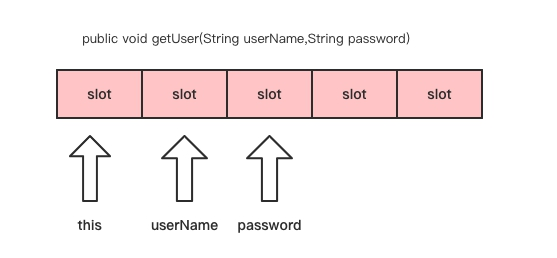
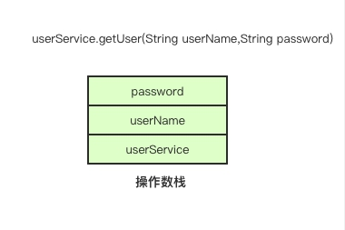

# Java 虚拟机栈
## JVM运行时内存结构
Java 虚拟机运行时数据区域分为**方法区**、**堆**、**虚拟机栈**、**本地方法栈**和**程序计数器**。如图：
### JIT（Just-In-Time）即时编译器
程序执行效率受限于代码的执行方式。代码执行方式一般有两种：
- **解释执行**（Interpreter）：程序逐行读取字节码（或源代码）并执行。优点是启动快、平台无关；缺点是执行速度慢。
- **编译执行**（Ahead-of-Time，AOT）：程序在运行前就被编译成机器码。优点是执行快；缺点是无法跨平台，启动慢。
JVM 的字节码设计初衷是跨平台，但纯解释执行会很慢，而完全提前编译成机器码又失去了平台无关性。所以使用 JIT。
JIT 即时编译器是一种在程序运行时将字节码动态编译为本地机器码的技术。它既保留了跨平台特性，又在运行时通过动态优化提高了性能。具体过程是：
1. 程序以字节码形式加载到 JVM。
2. JVM 的解释器开始解释执行字节码。
3. JIT 监控执行情况，热点代码、循环和频繁调用的方法。当某段代码被多次执行且成为“热点”，JIT 就会其编译成机器码。后续执行时直接使用机器码，以此提高性能。
### 堆（Heap）
Java 堆（Java Heap）是线程共享的，用于存放对象实例。
但并不是所有的对象都会存放在堆中。**JIT 即时编译器**会将多次被执行的字节码编译为机器码，同时也会分析方法体内的对象创建，如果方法体内创建的对象没有逃离出方法体之外，即不会被别的地方引用，也没有别的线程使用，那么就不需要将对象分配到堆中，而直接分配到虚拟机栈上。
### 方法区（Method Area）
方法区是线程共享的，用于存放虚拟机加载的类信息、常量、静态变量等数据。
在 `JDK1.8` 之前，HotSpot 虚拟机使用**永久代**实现方法区，而 `JDK1.8` 及之后使用**元数据区**实现方法区。**运行时常量池**是方法区的一部分，用于存放类被加载后的常量池表。
### Java 虚拟机栈（Java Virtual Machine Satck）
Java 虚拟机栈是线程私有的，它的生命周期与线程的生命周期相同。用于存储方法的**局部变量**、**操作数栈**、动态链接和方法返回地址等信息。
根据`《Java虚拟机规范》`的规定，`native` 方法应该在**本地方法栈**中执行，而在 HotSpot 虚拟机中，本地方法栈与虚拟机栈是合二为一的。
- **native 方法**：native 方法是用 `native` 关键字声明的 Java 方法。当 Java 本身无法实现某些操作（如访问硬件、调用系统 API）时，使用 native 方法调用非 Java 的代码（如 C、C++），其实现不在 Java 中。
- **本地方法栈（Native Method Stack）**：专为执行 native 方法服务的栈。它保存调用代码时的状态（参数、局部变量等）。
## 线程、栈与栈桢
### 线程
在 Java 中，Java 线程与操作系统线程一对一绑定，Java 虚拟机栈与操作系统线程栈一对一映射。
操作系统线程在 Java 线程创建时创建。指定 `-Xss` 值配置虚拟机栈的大小，实际上也是指定操作系统线程栈的大小。
当以 Java 命令启动一个 Java 程序时，首先启动一个 JVM 进程。JVM 启动后会加载类字节码执行。
程序中 main 方法是 Java 程序执行时的入口。JVM 会为 main 方法的执行分配一个线程，这个线程称为 main 线程。
```Java
public static void main(String[] args) {
    System.out.println(Thread.currentThread().getName());
    // 输出当前线程名：main
}
```
在 main 方法中编写的普通 Java 代码都会在这个线程（main 线程）中执行，而若在 main 方法中创建 Thread 对象并调用其 start 方法时，JVM 会为其创建一个 Java 线程，并对应创建一个操作系统线程，然后将这个操作系统线程绑定到新创建的 Java 线程上。最终，线程独立运行，不再与 main 线程共享执行流。此时 main 线程与新创建的线程在执行层面是完全独立的，不存在绑定关系。两个线程都由操作系统的调度器独立调度。
### 栈与栈帧
虽然 Java 是一种面向对象的语言，但程序运行依然基于方法的调用。**每个方法对应一个栈桢**。方法的调用对应栈桢的入栈和出栈。
方法中**局部变量表**与**操作数栈**都存储在栈帧中。局部变量表和操作数栈的大小都会影响到栈桢的大小，进而影响Java 虚拟机栈所能容纳的栈桢的最大数量。
在调用 Thread 对象的 start 方法时，该线程对应的虚拟机栈的第一个栈桢是 run方法。run 方法中每调用一个方法，就对应一个栈桢的入栈，一个方法只有执行结束才会出栈。方法执行结束包括方法抛出异常后结束、return 命令结束。
栈的大小是固定的，有一个默认栈大小。除此还可通过 `-Xss` 参数配置。如果调用链路过深，如递归方法，在栈没有足够的内存空间容纳下一个栈桢的入栈时，就会出现 `StackOverflowError` 错误，同时当前栈被销毁，当前线程结束。
## 局部变量表与操作数栈
### 局部变量表
局部变量表用以存储方法中声明的变量和方法参数。如果是非静态方法，还会存放 this 引用。
**局部变量表的大小是固定的**，在编译时就已经确定。因此在操作字节码时需要注意计算方法的局部变量表需要多大。如果设置过大会造成内存资源的浪费。
局部变量表的结构是一个数组，数组中的元素称为 `Slot（变量槽）`​。一个 `Slot` 的大小（字节数）由虚拟机决定。
- 在 32 位的 HotSpot 虚拟机中，一个 Slot 槽的大小是 4 个字节。
- 在 64 位的 HotSpot 虚拟机中，一个 Slot 槽的大小是 8 个字节。在开启指针压缩的情况下，一个 Slot 槽的大小是 4 个字节。
局部变量表结构如图：
### 操作数栈
操作数栈用于存储执行字节码指令所需要的参数。
- 如获取对象自身的字段，需要先将 this 引用压入栈顶，然后执行 getfield 字节码指令。
- 如执行 new 指令，栈顶会存放该 new 指令返回的对象的引用。
操作数栈与局部变量表一样，大小也是固定的，在编译期就已经确定，操作数栈中元素也称为 `Slot（变量槽）`。
与局部变量不同的是，操作数栈并不是由局部变量的数量决定栈的深度的，而是与需要传递最多参数的方法调用有很大关系。因此，操作数栈的深度相对来说比较难确定。操作数栈结构如图：
## 基于栈的指令集架构
在汇编语言中，除直接操作内存的指令外，其它指令的执行都依赖寄存器。
汇编指令集是由硬件直接支持的，不同架构的 CPU 提供的汇编指令集一般也不一样。


# Class 文件结构