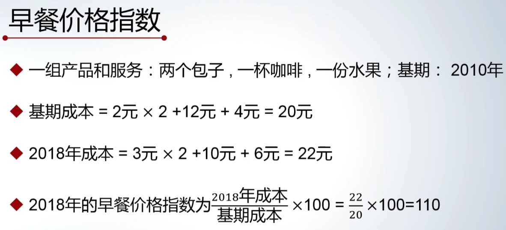

[宏观经济学_中国大学MOOC(慕课)](https://www.icourse163.org/learn/PKU-1205962805?tid=1471073506#/learn/content)
# 宏观经济指标
## 国内生产总值（GDP）
1929 年世界经济大萧条，美国构造出 GDP 的概念。1934 年，美国第一次系统性构造并发布出 GDP 的数据。此后，GDP 逐步推广到其他国家。
GDP 指一个国家或者地区在给定时间内新增的最终产品和最终服务的总价值。用以衡量经济的总体发展情况，是比较和分析经济形势的重要指标之一。
### GDP 数据的收集对象
GDP 收集数据的对象是**产品**和**服务**。
- **产品**：有具体物理形态的产出。如一支笔，一本书。
- **服务**：没有具体物理形态的产出。如音乐会上的一首歌。
### GDP 的计算原则
- GDP 只计算新增的**最终**产品和**最终**服务，不计入中间产品的价值。
- GDP 只计算**一个国家或者地区境内**的产出数据，对境内居民的国籍身份不做要求。
- GDP 只计算**给定时间范围内**的产出数据，不对此时间范围之外的数据纳入计算。对二次出售的产品，不计算二次出手时产出的价值。即对已经体现价值的产品，不计算其二次产生的价值。
- GDP 利用**市场价格**计算最终产品和最终服务的**总价值**。即预计这些商品和服务会在市场上出售时，用每一产品或服务的**市场价值**进行加总。
	- **市场价值**：人们对某个产品或服务产生的公允价格。
- GDP 只衡量市场经济活动，不包括**非市场经济活动**。
	- 非市场经济活动：没有在市场上形成交易和价格的活动。如义务劳动。
- 消解人们破坏性行为的经济活动会计入 GDP，此类 GDP 会夸大真正的产出和经济福利。
	- 如某个城市的河水被污染，政府请环保公司清理河水，由此花费的环保清洁费用开支会统计到 GDP。但这个经济活动仅仅是把环境恢复到原来的状况，并没有增加真正的经济福利。
- GDP 只衡量经济总体，反映总体经济发展的水平，不考虑产出后实际的分配情况。即不关心分配是否均衡。
### GDP 的理解角度
#### 从支出的角度
GDP 是产品和服务价值总和，如果从谁花钱购买产品或服务的角度，即从支出的角度理解，GDP 是**三种需求**的总和。
- **需求一**：最终**消费**的需求。包含**居民消费**和**政府消费**。
	- 消费：购买消费品的行为。
	- 消费品：一种可以直接**消费**以获得人们满足感的产出。包括产品和服务。
	- 居民消费：
	- 政府消费：
- **需求二**：**投资**的需求。
	- **投资**：用于形成或替换现有的**生产性资本**支出的行为。
		- 宏观经济学中的投资不包括金融投资。因为金融投资中的股票，投资于**现存**的生产性资本，不构成 GDP 中的投资。
- **需求三**：**净出口**的需求。
	- 净出口：`净出口 = 国内总进口 - 国内总出口`。用以衡量境外对境内产出的需求的程度。
#### 从供给行业的角度
如果从行业生产产品或服务的角度，即从供给行业的角度理解，GDP 是由**三大产业**贡献出来的，三大产业由国家统计局进行划分。
**第一产业**：农业、林业、牧业、渔业。
**第二产业**：采矿业、制造业、电力、热力、燃气及水生产和供应业、建筑业。
**第三产业**：通称**服务业**。是指除第一产业和第二产业以外的所有其他行业。
## 价格和价格指数
### 价格
### 价格指数
衡量总体价格的一个指数，描述**总体物价水平**。
#### 价格指数的构造
1. 选择一组产品和服务。
2. 选择一个**基期**（时间范围）作为参照。
3. 计算**基期成本**：计算在**基期价格**下购买这组产品和服务的成本。
4. 计算 **t 期成本**：任意其他时期 `t` 内，当时价格下购买这组产品和服务的成本。
5. 计算第 t 期的**价格指数**：`第 t 期的价格指数 = （t 期成本 / 基期成本） * 100`
	- 根据价格指数计算公式，基期价格指数为 100。`基期价格指数 = （基期成本 / 基期成本）* 100`
#### 价格指数的计算
示例：
#### 重要价格指数
- **居民消费价格指数**：CPI（Consumer Price Index）。包含一般消费者所购买的产品和服务，计算时使用市场零售价格。
	- 消费者所购买的产品和服务，包括国内消费品和进口的消费品。
- **国内生产总值平减指数**：GDP 平减指数（GDP deflator）。包含**国内生产**的所有产品和服务，计算时使用市场零售价格。
- 生产者出厂价格指数：PPI（Producer price index）。包含一个国家生产的所有产品和服务，计算时使用出厂价格。
	- PPI 能够衡量在企业的批发环节价格的变动情况。
### 通货膨胀
描述**总体物价水平**上升，即**价格指数**增大的情形。
注意：单一产品价格的上升通常只是相对价格的变化，不构成通货膨胀。
### 通货紧缩
## 就业和失业

# 经济增长
# 经济波动和财政政策
# 货币和货币政策
# 总供给总需求模型
# 国际经济