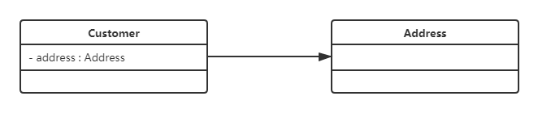

# 1. 引言
## 1.1 设计模式概述
### 1.1.1 软件设计模式的产生背景
1995 年，艾瑞克·伽马（ErichGamma）、理査德·海尔姆（Richard Helm）、拉尔夫·约翰森（Ralph Johnson）、约翰·威利斯迪斯（John Vlissides）等 4 位作者合作出版了《设计模式：可复用面向对象软件的基础》一书，书中共收录了 23 个设计模式，该书的问世是软件设计模式领域里的里程碑事件。
### 1.1.2 软件设计模式的概念
软件设计模式（Software Design Pattern），又称设计模式，是一套被反复使用的、多数人知晓的、经过分类编目的代码设计经验的总结。它描述了在软件设计过程中的一些不断重复发生的问题，以及针对此类问题的通用解决方案，具有一定的普遍性。
通俗地讲，设计模式是在开发软件时针对某类问题所产生的通用的、符合最佳实践的解决方案和编程方法。
设计模式的本质是面向对象设计原则的实际运用，是对类的封装性、继承性和多态性以及类的关联关系和组合关系的充分理解。
### 1.1.3 学习设计模式的必要性
- 提高程序员的思维能力、编程能力和设计能力，遇到问题时可提出更多更好的解决方案。
- 使设计的代码可重用性高、可读性强、可靠性高、灵活性好、可维护性强。
- 使程序设计更加标准化，代码编制更加工程化，提高软件开发效率，缩短软件开发周期。
### 1.1.4 设计模式的分类
#### 1.1.4.1 创建型模式
创建型模式描述如何创建对象。它的主要特点是将对象的创建与使用分离。
#### 1.1.4.2 结构型模式
结构型模式描述如何将类或对象按某种布局组成更大的结构。
#### 1.1.4.3 行为型模式
行为型模式描述类或对象之间如何相互协作或怎样分配职责，以共同完成单个对象无法独立完成的任务。
## 1.2 UML 图
UML（Unified Modeling Language，统一建模语言）是一种用于设计软件的可视化建模语言，提供了多种类型的图形从不同角度描述一个软件系统，包括用例图、类图、对象图、状态图、活动图、时序图、协作图、构件图、部署图等 9 种图。
### 1.2.1 UML 类图
#### 1.2.1.1 类图概述
类图（Class diagram）用于描述一个软件模型中存在的类的静态结构（类中的成员）以及与其他类的关系。
#### 1.2.1.2 类图的作用
- 类图作为一种静态的结构图，以图形化的方式简化了人们对系统的理解。
- 类图是系统分析和设计阶段的重要产物，是系统编码和测试的重要模型。
#### 1.2.1.3 类图中类的表示方式
- 在 UML 类图中，一个类使用包含类名、属性（field）和方法（method）且带有分割线的矩形来表示。分割线分割属性和方法。
- 属性/方法名称前用加号（+）、减号（-）、# 号表示可见性。
	- +：public
	- -：private
	- \#：protected
- 属性的表示方式：**可见性 名称：类型 \[ = 缺省值 ]**。中括号 \[] 中的内容表示可选。
- 方法的完整表示方式：**可见性 名称（参数列表）\[ ：返回值类型]**。中括号 \[] 中的内容表示可选。
- 示例：![[src/UML类图.png]]
#### 1.2.1.4 类图中类之间关系的表示方式
##### 1.2.1.4.1 关联关系
关联关系指对象之间的一种引用关系，用于表示一类对象与另一类对象之间的联系。如老师和学生、丈夫和妻子等。关联关系是类与类之间最常用的一种关系。
###### 1.2.1.4.1.1 单向关联
- 单向关联用一个带箭头的实线表示。如示例图表示每个顾客 Customer 都有一个地址 Address，通过让 Customer 类持有一个类型为 Address 的成员变量类实现。
- 示例：
###### 1.2.1.4.1.2 双向关联
###### 1.2.1.4.1.3 自关联
##### 1.2.1.4.2 聚合关系
##### 1.2.1.4.3 组合关系
##### 1.2.1.4.4 依赖关系
##### 1.2.1.4.5 继承关系
##### 1.2.1.4.6 实现关系
## 1.3 软件设计原则
### 1.3.1 开闭原则
### 1.3.2 里氏代换原则
### 1.3.3 依赖倒转原则
### 1.3.4 迪米特原则
### 1.3.5 合成复用原则

# 2. 主流设计模式
## 2.1 创建型模式
### 2.1.1 单例模式
### 2.1.2 原型模式
### 2.1.3 工厂方法模式
### 2.1.4 抽象工厂模式
### 2.1.5 建造者模式
## 2.2 结构型模式
### 2.2.1 代理模式
### 2.2.2 适配器模式
### 2.2.3 桥接模式
### 2.2.4 装饰者模式
### 2.2.5 外观模式
### 2.2.6 享元模式
### 2.2.7 组合模式
## 2.3 行为型模式
### 2.3.1 模板方法模式
### 2.3.2 策略模式
### 2.3.3 命令模式
### 2.3.4 职责链模式
### 2.3.5 状态模式
### 2.3.6 观察者模式
### 2.3.7 中介模式
### 2.3.8 迭代器模式
### 2.3.9 访问者模式
### 2.3.10 备忘录模式
### 2.3.11 解释器模式
# 3. 综合案例
## 3.1 Spring 框架
### 3.1.1 Spring 核心功能和结构
### 3.1.2 Spring 使用的设计模式
### 3.1.3 实现 Spring IOC
# 4. 参考资料
- [黑马程序员Java设计模式详解-bilibili](https://www.bilibili.com/video/BV1Np4y1z7BU/?spm_id_from=333.337.search-card.all.click&vd_source=b67a8b73e04ba6b70c23e64bc43b4b94)
